<div align="center">

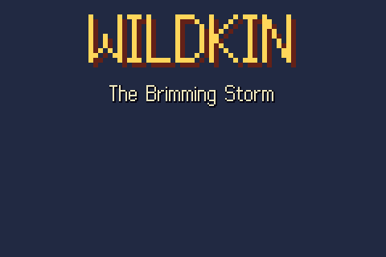

# WILDKIN — The Brimming Storm

**A creature-bonding adventure for the Game Boy Advance.**<br>
Written from scratch in C, with every pixel, map and sound generated by the scripts in this repo.

[](https://github.com/DrBlury/monquest/actions/workflows/build.yml)
[**⬇ Download the ROM**](https://github.com/DrBlury/monquest/releases/latest) ·
[How to play](#-how-to-play) ·
[The world](#-the-world) ·
[The kin](#-the-kin) ·
[Farming, crafting and fusion](#-farming-crafting-and-fusion) ·
[Build it yourself](#-building-from-source)

</div>

---

The storm clouds over Maple Village have been grumbling for weeks. The old
Almanac says that is how it started last time: **DRAKORA**, the Stormwyrm, has
not had a bout in a hundred years and is **brimming**. Today is your
**Kindling**, the day a young villager gets a first kin and becomes a warden.
Pick a partner, explore the Vale, learn what the kin really are, and climb
Stormstone Rise to answer DRAKORA's challenge before the storm breaks.

And that is only the start. Once the storm is answered, the Keeper hears that
old kernels are waking in the **Ashen March**, where a legend brimmed a
century ago and scorched the land. To reach its heart you will need all six
**crests** of the Wardens' Accord. Six towns, six Halls and six Hall Masters
stand between you and the Bone Throne. Along the way you can buy a farm, cook
and forge, weave kin from pure energy, and meet nine more legends in their
lairs.

| | |
| --- | --- |
| **174 kin** | 18 types, 20 rares, 10 legends and 44 fusion kin woven at the Loom |
| **78 maps** | the Vale plus 5 new regions: 24 outdoor areas, caves, crypts, halls and lairs |
| **6 Halls** | each with a puzzle, wardens and a six-kin Hall Master who awards a crest |
| **Systems** | day and night, weather, farming, crafting minigames, energy and fusion, bikes, ferries and field abilities |
| **161 Lorebook entries** | in 14 chapters, and **12 quests** in a quest log |

<table>
<tr>
<td width="50%">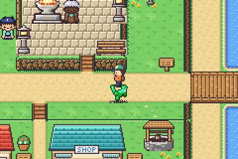</td>
<td width="50%">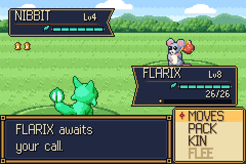</td>
</tr>
<tr>
<td align="center"><sub>Maple Village. Your lead kin walks behind you.</sub></td>
<td align="center"><sub>Bouts. Every move has its own animation and sound.</sub></td>
</tr>
<tr>
<td width="50%">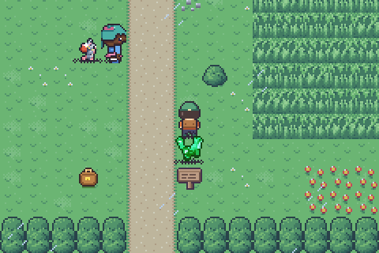</td>
<td width="50%">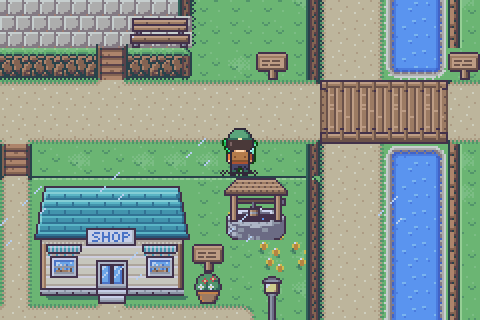</td>
</tr>
<tr>
<td align="center"><sub>Wardens challenge you when you walk into their line of sight.</sub></td>
<td align="center"><sub>The Lorebook keeps everything people tell you, sorted into chapters.</sub></td>
</tr>
</table>

## 🎮 How to play

### 1. Get the ROM

Download `wildkin-<version>.gba` from the
[**latest release**](https://github.com/DrBlury/monquest/releases/latest).
Every push to `main` also builds the ROM in CI; open a run on the
[Actions tab](https://github.com/DrBlury/monquest/actions) and download the
`wildkin-rom` artifact. Or [build it yourself](#-building-from-source) in a minute.

The ROM is free homebrew: no BIOS file, no original game and no copyrighted
data is needed or used.

### 2. Pick an emulator

| Platform | Emulator | Notes |
| --- | --- | --- |
| Windows, macOS, Linux | [**mGBA**](https://mgba.io/downloads.html) (recommended) | Open the `.gba` with *File → Load ROM*, or drag it onto the window. macOS: `brew install --cask mgba-app`. |
| Steam Deck, Linux handhelds | [RetroArch](https://www.retroarch.com/) with the **mGBA** core, or mGBA from Flathub | Keep the `.sav` next to the ROM. |
| Android | [Lemuroid](https://github.com/Swordfish90/Lemuroid) (free, mGBA core), Pizza Boy GBA, RetroArch | Put the ROM in a folder the app scans. |
| iPhone / iPad | [Delta](https://faq.deltaemulator.com/) (App Store) | Import via Files or AirDrop. |
| Real hardware | Any GBA flash cart (EZ-Flash, EverDrive GBA, ...) | The ROM declares **32 KB SRAM** saves (`SRAM_V113`), which every cart supports. |

The game runs at full speed on real hardware and in every accurate emulator.
It was developed and tested against mGBA.

### 3. Controls

| GBA button | Default key in mGBA | On the field | In menus and bouts |
| --- | --- | --- | --- |
| D-Pad | Arrow keys | Walk (tap to turn on the spot) | Move the cursor |
| **A** | X | Talk, read signs, check things, pick up satchels | Confirm, advance text |
| **B** | Z | Hold to **run** | Back, cancel, speed up text |
| **START** | Enter | Open the START menu | |
| **SELECT** | Backspace | Use the key item you registered in the bag, else open the **Lorebook** | Change the order of a bag pocket; find by type on the Shelf; a kin's area map in the Almanac |
| **L / R** | A / S | **R** hops on and off the **BIKE**; on your farm **L/R** switch tools | Switch bag pockets and Shelf boxes; page through long lists; switch kin on the summary; switch a shop between BUY and SELL; **L** in a wild bout throws your best lantern |

mGBA lets you change any of these under *Settings → Controllers*.

### 4. Saving

- **START → SAVE** saves at any time. The game keeps two checked 16 KB save
  slots, so a save interrupted by a power cut is never lost.
- Saves from older versions (v1 to v3) are upgraded automatically when you
  load them. Your team, Shelf, bag and progress carry over.
- With **Autosave** on (the default), the game also saves every time you walk
  into the Hearth Hall you last rested in. Resting there also makes it the
  place you wake up after all your kin doze off.
- Emulators write the save next to the ROM as `wildkin-….sav`. Copy that
  file to move your game to another device.

### 5. First steps (no spoilers)

1. Start a **NEW GAME** and read the storybook. You wake up at home.
2. Walk to the **Almanac House** (the big blue roof at the top of the
   village) and talk to **Keeper Linden** to hold your Kindling. Choose
   **FLARIX** (BLAZE), **AQUAPO** (TIDE) or **DANDELAMB** (BLOOM).
3. Talk to everyone. People tell you how the world works; each new piece of
   lore is added to your Lorebook.
4. Leave the village north, east or west. Wild kin roam the tall grass:
   brimming ones run at you and want a bout. Calm, tired kin can be
   befriended with a **lantern**.
5. When you feel ready, take on **Warden Marlo** down in the sunken Bout
   Ring, across the Maple Run bridge.
6. After the storm, the Vale opens up: the road east to **Lumen City**, the
   coast in the west, the frozen north beyond the Rise, and **Willow Acre**,
   the farm south of the village.

<table>
<tr>
<td>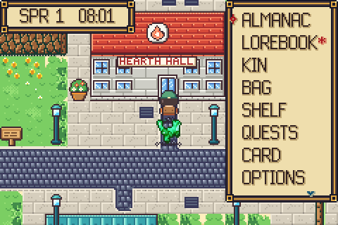</td>
<td>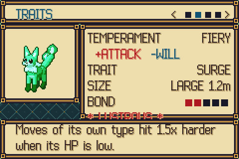</td>
<td>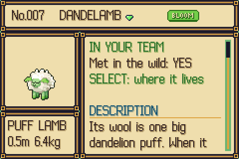</td>
</tr>
<tr>
<td align="center"><sub>START menu with the day and time</sub></td>
<td align="center"><sub>Every kin has its own temperament, trait, size and potential</sub></td>
<td align="center"><sub>The Almanac: habitats, level ranges, rarity, growth</sub></td>
</tr>
</table>

## 🌍 The world

The world is a web of regions around the Vale. Walk off an edge into the next
area, take a door, sail on the ferry, or fly between towns once you hold the
RIME crest.

```
                        [SKY ISLE] (FLY)
          [WHITECROWN PEAK]
               |
         FROSTHOLLOW ---- GLIMMER CAVERNS -- [STARFALL GROTTO]
               |
         FROSTPINE PASS                       DREAMSPIRE -- [DUST LIBRARY]
               |                                   |
        STORMSTONE RISE                      MOONVEIL PATH
               |                                   |
         WHISPER MEADOW                        LUMEN CITY ---- CINDER ROAD ---- CINDERMOOR -- EMBER TUNNEL -- [CALDERA HEART]
               |                               /   |                             |
 PORT BRINE - SALTWIND - MIRROR LAKE - MAPLE - BRAMBLEWOOD - COPPERLINE ROAD     [CLOCKWORK SPIRE]
    |                        VILLAGE     |       |
 SEA ROUTE                     |    [ELDERWOOD   ASHEN FIELDS - GRAVEWOOD - DUSKMERE - THE OSSUARY - [BONE THRONE]
    |                    WILLOW ACRE    HEART]
 GULL ISLE - [DROWNED BELL]    (farm)
```

<sub>Places in [brackets] are lairs and hidden places.</sub>

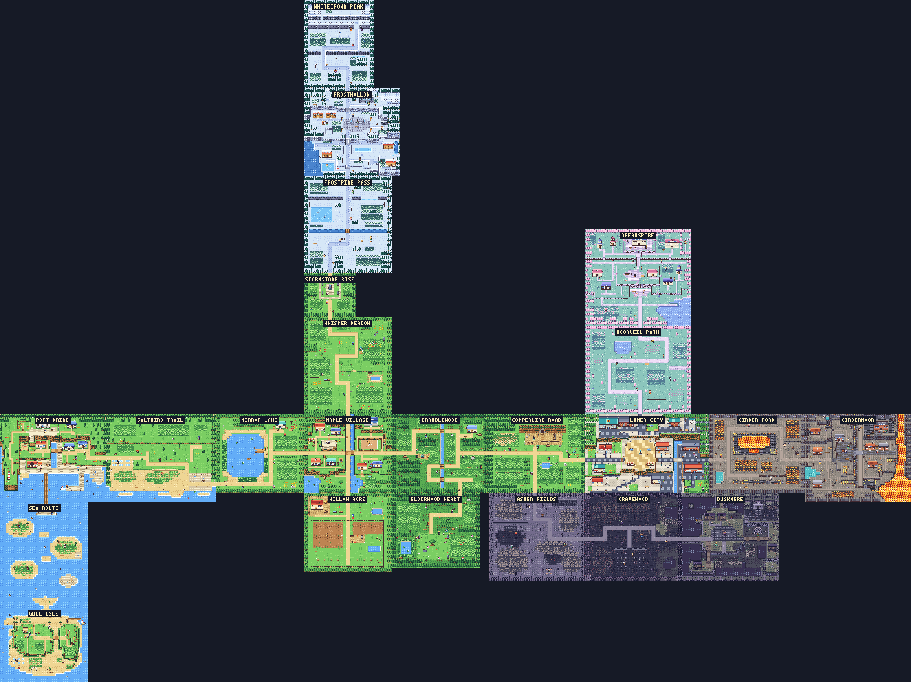

<sub>Every outdoor area, drawn by the game's own map code and joined edge to
edge the way you walk between them (the Sky Isle is only reached by air).</sub>

### The Vale

| Area | What you find there |
| --- | --- |
| **Maple Village** | A village on four levels: home and the bakery on the north ridge, the Almanac House on its knoll, the raised Old Hearth plaza, High Street with the Hearth Hall and the shop, the sunken Bout Ring, a lily pond, and the Maple Run bridge you cross on top or walk under along the creek. Look for a gap in the thicket |
| **Whisper Meadow** (north) | Open grass, flower beds, ledges to hop down, the kite flyer and a shepherd with a PUFFLEECE. Wild kin Lv 2-9 |
| **Bramblewood** (east) | Dense forest, a creek with bridges, mushrooms, a hermit's cabin. Wild kin Lv 4-11 |
| **Mirror Lake** (west) | A shore with reeds, a dock and rowboat, and Dr. Vass's field station. Wild kin Lv 5-11 |
| **Stormstone Rise** | The standing stones above the meadow, where DRAKORA waits. Wild kin Lv 9-17 |
| **Willow Acre** (south) | Your own farm, once you buy the deed from Reeve at the Land Office in Maple Village |

<table>
<tr>
<td>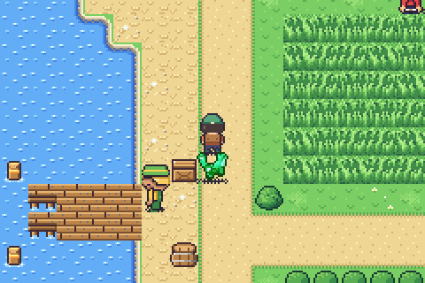</td>
<td>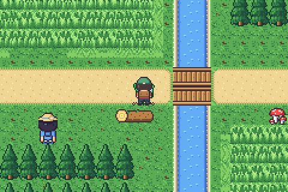</td>
<td>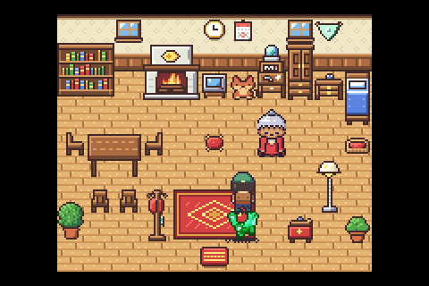</td>
</tr>
<tr>
<td align="center"><sub>Mirror Lake's dock</sub></td>
<td align="center"><sub>The creek in Bramblewood</sub></td>
<td align="center"><sub>Home, with Gran and a fire going</sub></td>
</tr>
</table>

### The new regions

<table>
<tr>
<td width="33%">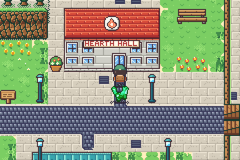</td>
<td width="33%">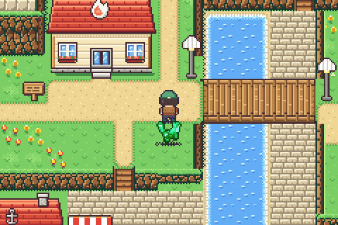</td>
<td width="33%">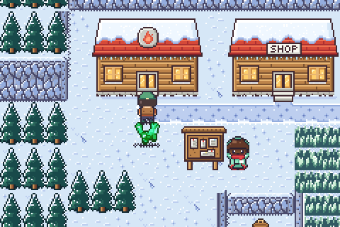</td>
</tr>
<tr>
<td align="center"><sub><b>Lumen City</b>: the walled city of the east</sub></td>
<td align="center"><sub><b>Port Brine</b>: harbour town of the west coast</sub></td>
<td align="center"><sub><b>Frosthollow</b>: the snow village beyond the Rise</sub></td>
</tr>
<tr>
<td width="33%">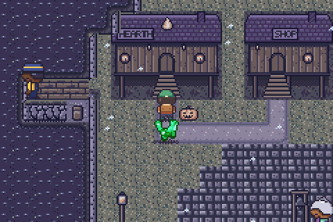</td>
<td width="33%">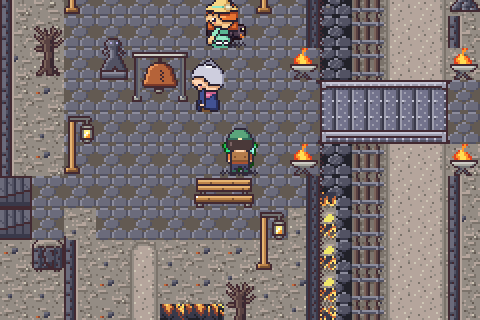</td>
<td width="33%">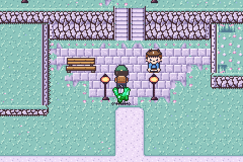</td>
</tr>
<tr>
<td align="center"><sub><b>Duskmere</b>: a stilt town in the ash-grey March</sub></td>
<td align="center"><sub><b>Cindermoor</b>: forges on the volcano's flank</sub></td>
<td align="center"><sub><b>Dreamspire</b>: moonstone towers above the clouds</sub></td>
</tr>
</table>

| Region | Areas | What you find there |
| --- | --- | --- |
| **East** | Copperline Road, **Lumen City**, Elderwood Heart, Clockwork Spire | An old copper mine and a prospectors' camp; a walled city with a market, canals, the BEACON tower, the Copper Kettle Inn, the bike shop and the **Resonance Works**; the ancient Elder's glade behind Bramblewood's boulders; a clock tower with a legend at its crown. Wild kin Lv 15-40 |
| **West** | Saltwind Trail, **Port Brine**, Sea Route, Gull Isle, Drowned Bell | Dunes and salt pans; a harbour with quays, piers, a lighthouse and the Gull Inn; open sea to cross by surfing or the ferry; an island with a whale-rib arch and a sea cave that leads to a sunken bell |
| **North** | Frostpine Pass, **Frosthollow**, Whitecrown Peak, Glimmer Caverns, Starfall Grotto, Sky Isle | Snowy pines and a skating pond, a hot spring whose soak heals, switchbacks up to a summit, two dark crystal caverns with an underground lake, and an island above the clouds you can only reach by flying |
| **The Ashen March** | Ashen Fields, Gravewood, **Duskmere**, the Lantern Crypt, the Ossuary, the Bone Throne | Grey fields where ash falls, a fenced cemetery in a dead wood, a town on stilts over the mire, a dark crypt maze, and the bone halls where the story ends. Once the March is healed, the haze lifts and the rain returns |
| **Far** | Cinder Road, **Cindermoor**, Ember Tunnel, Caldera Heart, Moonveil Path, **Dreamspire**, Dust Library | Steam vents and a mountain forge with a great bell; a lava tube to the caldera; a moonlit path of blossom trees up to a city of towers and a library where the pages drift in the air |

### The six Halls

Every Hall has a puzzle, a few wardens and a **Hall Master** with a full team
of six. Beat the Master to earn a crest. Each crest lets kin with the right
build use an ability in the field.

| Town | Hall | Type | Puzzle | Crest |
| --- | --- | --- | --- | --- |
| Lumen City | VOLT HALL | SPARK | Floor switches raise and lower crackling barriers. Find the right order. | VOLT: **LIGHT** brightens dark caves |
| Port Brine | CURRENT HALL | TIDE | One-way channels between isles. Floodgate switches reroute the water, and one switch flips every time the current carries you over it. | TIDE: **SURF** across water |
| Cindermoor | ANVIL HALL | METAL | Push boulders onto pressure plates to open the gates. | ANVIL: **STRENGTH** moves boulders |
| Frosthollow | RIME HALL | FROST | A slide maze on the lower rink, then a pumice boulder to push into place so your slide stops under the dais. | RIME: **FLY** to any town you have visited |
| Duskmere | LANTERN CRYPT | HOLLOW | A dark crypt in a small circle of light. Candle switches open the sanctum gates, but some seal the way you came; star pads lead out. | LANTERN: the Ossuary gate opens for holders of all six crests |
| Dreamspire | MIRROR HALL | DREAM | Six rooms in mirrored pairs: opening one doorway shuts its twin, and pad pairs link the rooms. | DREAM: **TELEPORT** back to the last Hearth Hall |

<table>
<tr>
<td width="33%">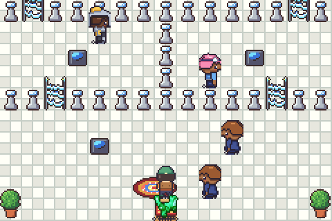</td>
<td width="33%">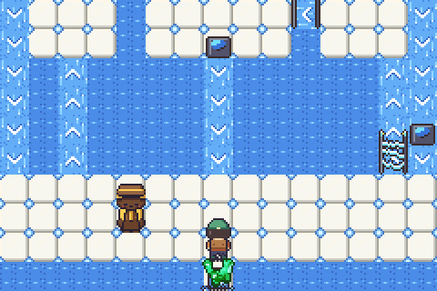</td>
<td width="33%">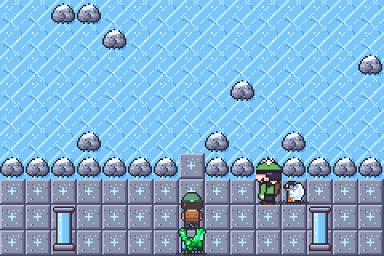</td>
</tr>
<tr>
<td align="center"><sub>VOLT HALL: switches and barriers</sub></td>
<td align="center"><sub>CURRENT HALL: ride the currents</sub></td>
<td align="center"><sub>RIME HALL: slide across the ice</sub></td>
</tr>
<tr>
<td width="33%">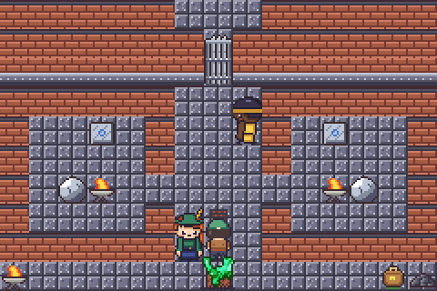</td>
<td width="33%">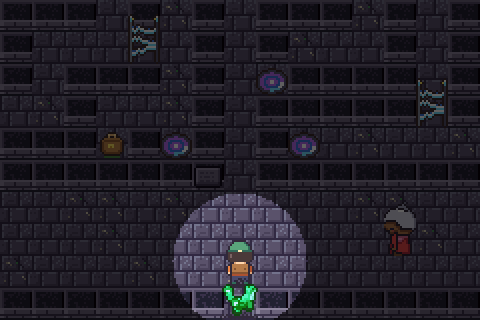</td>
<td width="33%">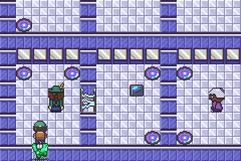</td>
</tr>
<tr>
<td align="center"><sub>ANVIL HALL: boulders, plates and gates</sub></td>
<td align="center"><sub>LANTERN CRYPT: find your way in the dark</sub></td>
<td align="center"><sub>MIRROR HALL: teleport pads</sub></td>
</tr>
</table>

### Legends and their lairs

Ten legends each wait in one place, and you get one chance to answer each. A
legend rears up with a roar and a shockwave when the bout starts, and you
can't run from it.

<table>
<tr>
<td width="33%">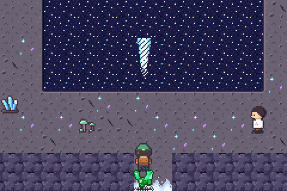</td>
<td width="33%">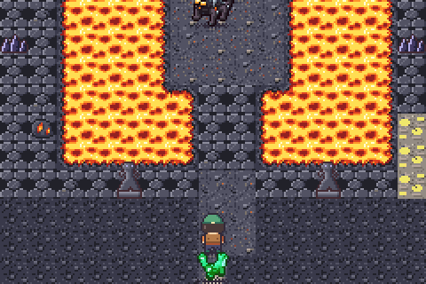</td>
<td width="33%">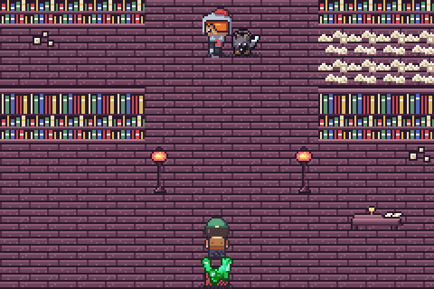</td>
</tr>
<tr>
<td align="center"><sub>Starfall Grotto, under the caverns</sub></td>
<td align="center"><sub>Caldera Heart, at the end of the Ember Tunnel</sub></td>
<td align="center"><sub>The Dust Library, above Dreamspire</sub></td>
</tr>
<tr>
<td width="33%">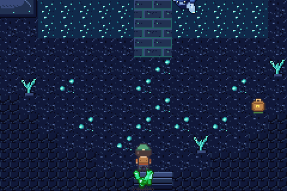</td>
<td width="33%">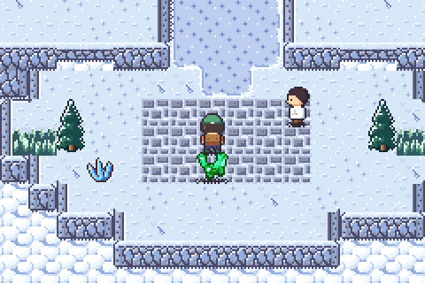</td>
<td width="33%">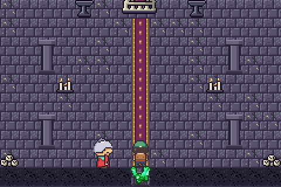</td>
</tr>
<tr>
<td align="center"><sub>The Drowned Bell, in Gull Isle's sea cave</sub></td>
<td align="center"><sub>Sky Isle: only a flyer gets here</sub></td>
<td align="center"><sub>The Bone Throne, at the end of the story</sub></td>
</tr>
</table>

### Getting around

- **Crests and field abilities**: SURF, STRENGTH, LIGHT, FLY and TELEPORT.
  Each needs its crest and a kin in your team that can do it. START → FIELD
  lists what you can use right now.
- **The BIKE**: run errands for the Lumen tinker to get one, then press R to
  ride at double speed outdoors.
- **The ferry**: sails between Port Brine and Gull Isle for 500 coins, or
  for free with the FERRY PASS, with a short voyage scene.
- **The TOWN MAP** shows every place you have visited and where you are.
- **Map objects**: boulders to push (some light pumice ones need no crest),
  pressure plates and gates, floor switches and barriers, teleport pads, ice
  that you slide on, water currents, chests (a few are mimics), ladders and
  berry bushes.
- **Dark places** only show a small circle of light until a kin uses LIGHT.
- A banner shows each area's name when you walk in.

### Why do people live with kin?

A **kin** is an animal built around a **kernel**: a pebble-sized living
crystal that holds a condensate, billions of light-matter particles (*motes*)
all sharing one quantum state. The condensate shapes and powers the body. Each
kin tops it up from one kind of energy (heat, sunlight, static, moving water,
...), and that is its **type**.

A kernel can only hold so much. A kin that is over-full **brims**, and its
surplus leaks out as heat waves, static storms, frosts and floods. When two
kin clash in a **bout**, every blow knocks motes loose. The energy soaks into
the land as warm soil and gentle rain, and a kin that runs low simply
**dozes** until it refills. Nobody gets hurt, and the weather stays kind.

That bargain is the **Kinship**: people hold the bouts and give kin names,
food and a lantern to rest in; kin share their strength and keep the seasons
gentle. It is also why answering a wild kin's challenge is good manners
("every bout is a bucket of rain," as the farmers say), and why a brimming
Stormwyrm is a problem for the whole Vale.

The in-world science is based on real physics: exciton-polariton
condensates, high-finesse optical cavities, quantum teleportation, the
no-cloning theorem and nucleation. The Lorebook explains all of it in
**161 entries** across 14 chapters. The chapters include energy and fusion,
farming, crafting, the Halls and the Hollowing. For the full design bible (story, science,
types, all kin, moves and items) see [**docs/WORLD.md**](docs/WORLD.md).

<details>
<summary><b>How does a lantern hold a kin?</b> (spoiler-free science)</summary>

A lantern's heart is two mirrors of **heartglass**, an optical cavity with an
extremely high quality factor that can hold a condensate for years with almost
no loss. A kin's identity lives in its kernel's quantum pattern, not in its
flesh. When a calm kin *mode-matches* the cavity, the kernel and its
condensate slip inside. Motes are bosons, so all of them fit into a single
mode a few microns wide. The rest of the body (mostly water, carbon and
silica held in shape by the field) is shed as a puff of glittering mist. On
release, the re-pumped field pulls matter back out of the air and ground and
the body grows around the kernel in a second or two, the way a snowflake
grows around its seed. That is the flash when a kin comes out, and why a kin
let out in a desert is always thirsty.

Only a condensate near its ground state can make the jump without
decohering, so a fresh, struggling kin can't be caught. And any kin can
refuse by driving its own field out of tune. Catching is consent.
</details>

## 🐾 The kin

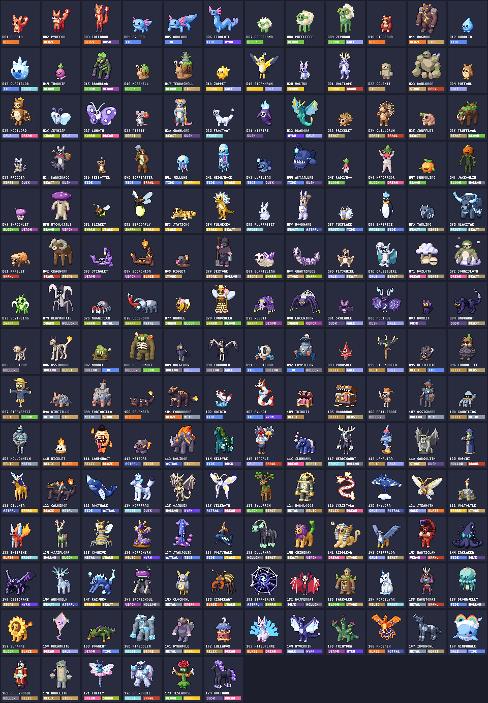

**174 kin across 18 types**: BEAST, BLAZE, TIDE, BLOOM, SPARK, FROST, BRAWL,
VENOM, STONE, GALE, DREAM, SWARM, DUSK and WYRM, plus four new ones:

| Type | What it is |
| --- | --- |
| **HOLLOW** | Old kernels that rebuilt their bodies from bone and ash. They can't be poisoned. |
| **RELIC** | Kin bound to old made things: coins, clocks, lamps and books |
| **METAL** | Ore and alloy bodies. They can't be poisoned either. |
| **ASTRAL** | Kin that feed on starlight and moonlight |

Matchups follow the physics: water quenches heat, charge races through
water, stone grounds charge, and dusk kin drink the light of blaze kin.

The Almanac marks each kin's **rarity** with a coloured gem:

| Rarity | How you meet them |
| --- | --- |
| **Common / uncommon** | Wild in the grass, caves and water. Some only come out by day, others only at night |
| **Rare** (20) | At 1-4% odds, at night, in special spots, or hiding as a mimic chest |
| **Legend** (10) | One each, waiting in its lair |
| **Fusion** (44) | Never wild: woven from energy at the Fusion Loom |

> Work in progress: not every new kin has its final art yet. Kin that are
> still drawn as simple round placeholders in the gallery above play the same
> as the rest; only their sprite is a stand-in.

**No two kin are alike.** Every kin you meet is rolled with:

| | |
| --- | --- |
| **Potential** | Six hidden values (0-31) that the summary grades from DUD to PERFECT |
| **Temperament** | One of 16 (FIERY, STEADY, CURIOUS, DREAMY, ...): +10% to one stat, -10% to another |
| **Trait** | One of two for its species, from 21 traits such as SURGE, THICK FUR, DRIFTER, SOAKER, STATIC FUR, BASKER, MOMENTUM, QUICK STUDY |
| **Size** | TINY to HUGE; height and weight follow |
| **Lustre** | 1 in 128 kin are **lustrous**: a rare hue-shifted palette and a sparkle when they come out |
| **Bond** | Grows with bouts, steps walked together and treats. A close kin may hang on at 1 HP or shake off a status problem |

Wild kin in the same patch of grass come in a range of levels, and you can see
them wander the grass before you touch them.

## 🌾 Farming, crafting and fusion

### Day, night and weather

- One game minute passes for every second on the field, and a new day starts
  at 06:00. The year turns through **SPRING, SUMMER, AUTUMN and WINTER**,
  10 days each. The START menu shows the season, day and time (the HUD can
  too), e.g. `SPR 3  14:05`.
- Outdoors, the light turns warm at dusk and dawn and blue at night. Some
  wild kin only come out by day, others only at night.
- Some days it rains. Rain waters your crops for you.
- Sleep in any bed to skip to the next morning.

### Willow Acre, your farm

Buy the deed from **Reeve** at the Land Office (bring her three GLOWBERRY
first and she knocks a third off the price). You get the HOE, the WATERING
CAN, a pack of seeds and a farmhouse.

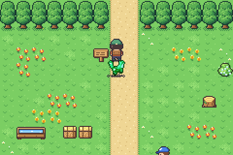

- **Crops**: till, plant, water, fertilise and harvest 18 crops. Each one
  grows through its own stages (seeded, sprout, young, growing, ripe). Some
  grow back after picking, and apple and peach trees keep fruiting. Good care
  gives GREAT and PERFECT harvests with extra yield. Sprinklers water for you.
- **Seasons**: every crop has its seasons. Strawberries in spring, melons,
  tomatoes and chilies in summer, pumpkins and eggplants in autumn, snow peas
  and the rare motebloom in winter. Seeds only take in season, Reeve sells
  the seeds of the season, and when the season turns, crops that don't
  belong to it wither (clear them with any tool). Fruit trees rest in
  winter.
- **Selling and goods**: sell your harvest at **any shop** (L/R switches a
  shop between BUY and SELL). Produce fetches its full worth there, and
  anything else sells for half its price. Or leave it in the shipping bin,
  which pays out the next morning. The jar, the press and the drying rack
  turn crops into preserves, pressed drinks and dried goods overnight.
- **Workers**: pin up to four kin from the Shelf on the work board. Each
  morning they water, tend, harvest, chase off crows, forage and collect
  honey, and they gain bond and XP. They walk around the farm and you can
  talk to them.
- **Wild berries** grow on bushes along the routes and come back after a few
  days.
- Each morning, a short report tells you what happened on the farm.

### Crafting

Three teachers teach 32 recipes, and each station is its own small game:

| Station | Teacher | Minigame | Makes |
| --- | --- | --- | --- |
| **Kitchen** (stove, oven, campfire, cooktop) | the Chef | Toss the pan on a shrinking mark, then stir by rolling the D-pad | 13 dishes: meals that boost XP, stats or lantern odds for your next bouts, plus drinks and treats |
| **Cauldron** | the Brewer | Hold A to keep the heat in a drifting band, then catch the big bubble | 8 brews: tonics and remedies |
| **Forge** (anvil) | the Smith | Strike on the beat, then quench | 11 pieces: lanterns, coils and gear |

Results are rated PERFECT, GREAT or OK. Better lanterns and potions come out
in extra numbers, and better dishes give longer, stronger buffs. A burnt
dish, fizzled brew or cracked piece costs one batch of ingredients. The
RECIPE BOOK lists what you know and what you're missing.

### Energy and the Fusion Loom

At Lumen's **Resonance Works**, Engineer Nell shows you four machines:

- **Extractor**: release a kin back into pure energy of its type. Rarer,
  higher-level and lustrous kin give more.
- **Energy flask**: shows your 18 energy pools, where each comes from and
  what it weaves with.
- **Mixer**: 26 recipes turn one energy into another. A tuning minigame (two
  knobs, a match meter and a timer) decides the yield.
- **Fusion Loom**: pick up to three energies and a stake, and try to weave a
  fusion kin. The odds are shown on screen. They rise with a bigger stake,
  with harmony between the energies and with every miss, until a weave is
  guaranteed. A miss still leaves MOTE DUST and part of your stake.

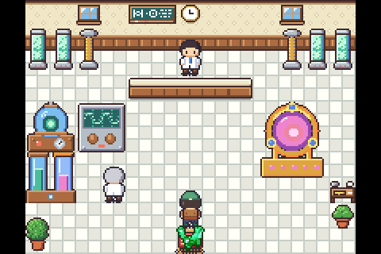

## ✨ Features

- **A living overworld**: wild kin roam the grass and chase you when they
  brim, villagers walk their rounds, some people walk their kin beside them,
  and your lead kin follows you (and reacts when you talk to it).
- **Wardens with sight lines**: step into a warden's view and they spot you,
  walk up and challenge you.
- **Height**: terraces, cliffs and ledges, stairs, bridges you cross on top
  and walk under the other way, tunnels and hidden passages
  ([docs/ELEVATION.md](docs/ELEVATION.md)). Every town is built on
  several levels, with a bridge or tunnel you pass both over and under and a
  hidden path to find. Found passages stay open in your save.
- **Ground that blends**: sand, soil, dirt, mud, moss, basalt and sulfur
  fade into the ground around them with soft, ragged edges instead of hard
  squares, while shores, paths and buildings keep their crisp lines.
- **Grass that moves**: each region has its own tall grass (meadow, reeds,
  flowers, golden, dune, snow-capped, glowing moss, dead bracken, ember brush,
  moonpetal) that sways in the wind and parts when you walk through; only
  your legs disappear in it.
- **Puzzles that are proven solvable**: a solver plays every puzzle map with
  the game's own movement rules and checks that nothing can trap you.
- **A storm you can end**: until DRAKORA is answered the Vale is dark, rain
  falls and lightning flashes. Afterwards the sky clears.
- **78 maps across twelve tilesets** (village, wild, interior, city, coast,
  snow, cave, grim, crypt, volcanic, dream and farm), dressed with 264 kinds
  of furniture and outdoor details. That includes fireplaces, pianos and
  aquariums; lighthouses, boats and bell buoys; steam vents, forges and a
  great bell; gravestones and wisps; moon lanterns and floating pages. Many
  are animated, and most say something when you examine them.
- **Keepers on the field**: in a bout with another keeper you both stand on
  the field: they stride in, strike their pose and throw their lantern, you
  wind up and throw yours, and when it is decided they walk back in, proud or
  sheepish. Wardens and Masters wear the same look on the map. There is no
  running from a keeper's bout; in the wild the bag shows each lantern's odds
  of befriending the kin in front of you.
- **Wardens and Masters**: 84 warden teams of up to six kin, plus six Hall
  Masters. A Master's bout opens with a banner, and winning it plays a
  victory fanfare.
- **Bouts that feel good**: 130 moves, each with its own animation. Blows
  freeze for a beat, flash, squash the target and shake the screen (harder on
  weak spots and perfect strikes). Big moves tint the sky with their type, HP
  bars drain smoothly and change colour, and every bout opens with the field
  dissolving into a ring of lantern light. Sound effects play on the GBA's
  own sound channels. There are 16 battle backgrounds, one per kind of place
  (meadow, forest, city, coast, open sea, snow, cave, grim, crypt, volcano,
  dream, farm, lairs and more).
- **Smarter wardens**: the AI weighs matchups, switches kin when it's losing
  and plays around traits.
- **Rules with depth**: five status problems (BRN, PSN, NMB, SLP, FRZ),
  perfect strikes, stat stages, priority, draining, recoil, multi-hit and
  healing moves. 21 traits trigger visibly in bouts, and the AI plays around
  them.
- **The Lorebook**: a scrollable knowledge base with chapters. Lore unlocks
  as you talk to people and examine things, and you can re-read it any time
  with SELECT.
- **The Almanac**: every kin with its description, stats, growth, move list
  and where it lives (with level ranges and how rare it is). Press
  **SELECT** on a kin you have met to see its **area map**: every place it
  lives is ringed on the town map, with levels, rarity, and whether it comes
  out by day, at night or on the water.
- **Growth**: kin grow into new forms at a level or when they touch a
  **shard** (BLOOM, SPARK, DUSK, FROST).
- **Quests**: 12 quests across the regions, from delivering the harbour post
  to lighting the long northern night, plus the main Hollowing quest. The
  quest log lists open quests first, each with its goal.

<table>
<tr>
<td>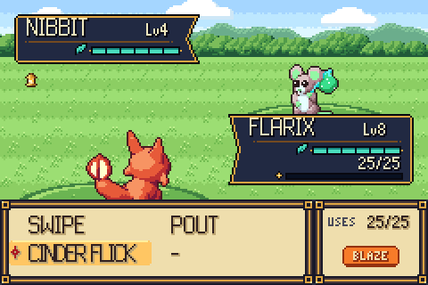</td>
<td>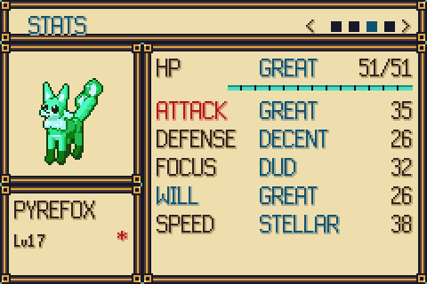</td>
<td>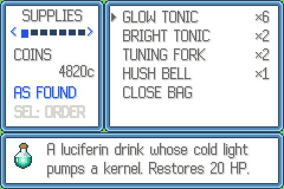</td>
</tr>
<tr>
<td align="center"><sub>The move menu shows uses, type and matchup</sub></td>
<td align="center"><sub>Potential grades; the temperament colours its stats</sub></td>
<td align="center"><sub>The bag: seven pockets, three sort orders</sub></td>
</tr>
</table>

### Quality of life

- Run with **B** from the start; hold A or B to speed up text.
- **Options**: text speed (4 settings), bout animations, bout speed (double
  speed plays every event and animation twice as fast), sound, follower, HUD
  clock, bike on R, and autosave.
- **The bag** has seven pockets (supplies, lanterns, shards, food, farm,
  materials, key items). Each pocket remembers its cursor, and SELECT sorts it
  as found, A to Z, or most first. Register a key item (like the BIKE) to
  SELECT.
- The whole team earns XP (the bench gets half), and befriending a kin also
  gives XP.
- The move menu tells you when a move will strike a weak spot, or be shrugged
  off, against the current foe.
- **L** in a wild bout throws your best lantern.
- The wild HUD shows a lantern icon when you have already befriended that kin.
- The **Lantern Shelf** (your storage) is reachable from the START menu once
  you have the TWIN CRYSTAL. It has 8 boxes of 30. You can withdraw,
  deposit, move and release kin, sort a box or all boxes (by number, level,
  type, rarity or newest), give each type its own box, and find kin by type.
- **The Almanac filters** by met or befriended, by any of the 18 types, by
  rarity and by region. Each entry lists where and when a kin appears and,
  for fusion kin, which energies it is woven from.
- **The CREST CASE** shows the crests you have and what each one unlocks.
- Keeper Linden can re-teach moves your kin forgot.
- **HUSH BELL** keeps wild kin away for a while.
- The summary shows temperament, trait, potential grades, size, bond and
  where and when you met each kin.
- Beds heal your team; resting at a Hearth Hall heals, sets where you wake up after a lost bout, and autosaves there.
- Two checked save slots; older saves are migrated automatically.
- **Debug tools** for the curious: tap SELECT+START on the title screen for
  an asset viewer, a kin viewer, a WARP menu and the ADMIN MODE switch.
- **ADMIN mode** (off by default): add coins, give yourself any item, add
  any kin at any level with any four moves, teach any move, heal the team.
  See *Debugging* below.

## 🛠 Building from source

You need a bare-metal ARM GCC, Python 3 (standard library only) and
[`gbafix`](https://crates.io/crates/gbafix). No devkitPro install is needed.

**macOS**

```bash
brew install arm-none-eabi-gcc arm-none-eabi-binutils
```

```bash
cargo install gbafix
```

**Debian / Ubuntu**

```bash
sudo apt install gcc-arm-none-eabi binutils-arm-none-eabi python3 cargo
```

```bash
cargo install gbafix
```

Then:

```bash
make
```

That writes `game.gba`. Other targets:

| Command | What it does |
| --- | --- |
| `make run` | Build and open the game in mGBA |
| `make test` | Build and run the host-side test suites: rules, bouts and every move, a round-robin balance simulation over the whole roster, maps, reachability (with puzzles solved and surfing), every region and Hall puzzle, traversal, farming, crafting, fusion, the UI and saves |
| `make art` | Regenerate every art header from the Python generators |
| `make maps` | Render every map to `build/maps/*.png` |
| `make shot` | Build the headless screenshot harness (needs libmgba: `brew install mgba`) |
| `python3 tools/make_media.py` | Re-record every GIF and screenshot in this README |
| `make clean` | Remove build output |

### How it is made

- **Unity build.** `src/main.c` includes every module in `src/game/`. The
  tests compile the same file on the host with the hardware registers,
  VRAM, OAM and SRAM mapped to plain arrays, so they can drive whole screens
  and bouts frame by frame.
- **Generated art.** Every tile, sprite, palette and particle is drawn by
  Python scripts in `tools/`. There's a small 3D-primitive renderer for the
  kin (one spec per kin in `tools/kin/`) and a pixel-art toolkit for terrain
  and decor. Each of the 12 tilesets is its own module in `tools/tilesets/`.
  An art lint fails the build if a tile has baked-in ground or its colours
  don't fit a palette bank. The output is deterministic 4bpp
  data in `src/gfx_*.h`, and CI checks that it is up to date.
- **Graphics.** Mode 0 with four layers: ground, a transparent decor layer,
  a top layer that draws tree tops and roofs over the player, and a bitmap
  canvas for text and menus with a variable-width font. Decor tiles are
  loaded per map to fit the 512-tile budget. Trees and roofs are drawn as
  overlays on real ground tiles.
- **World data.** Each region lives in `src/game/world/<region>/`, one file
  per registry (maps, warps, people, wardens, signs, satchels, zones, quests,
  lore, fly points and scripts). The shared `world.h` includes them all.
- **Media.** `tools/shot.c` runs the ROM headless in libmgba from a script
  of inputs and writes PNGs. `tools/make_media.py` builds demo saves, records
  clips and encodes the GIFs with a small pure-Python GIF encoder.

<details>
<summary><b>Project layout</b></summary>

```
src/main.c              unity build root, main loop, frame presenter
src/game/gba.h          registers (plain memory on the host), input, RNG, strings
src/game/data.h         types, the 18x18 type chart, traits, temperaments, items
src/species_data.h      GENERATED: all 174 species (from tools/kin/)
src/game/moves.h        120 moves and their animation recipes
src/game/lore.h         Lorebook chapters and the intro storybook
src/game/items/*.inc    the 108 items, one file per owner
src/game/options.h      player options (saved with the game)
src/game/monster.c      stats, potential, temperament, XP, learning, growth
src/game/party.c        team, Lantern Shelf storage, bag, coins, move learning
src/game/gfx.c          UI canvas, variable-width text, windows, bars, sprites
src/game/msg.c          typewriter message box, choices, dialog queue
src/game/battle.c       bout rules that queue presentation events
src/game/battle_ui.c    event playback, HUD, bout menus, transitions
src/game/anim.c         move animation patterns
src/game/sfx.c          sound effects on the GBA's PSG channels
src/game/field.c        maps, decor, movement, ledges, followers, wild kin, weather
src/game/world/         every region: maps, people, wardens, lore, quests, scripts
src/game/script.c       people, story, wardens' sight lines, examining things
src/game/travel.c       map objects, crests and field abilities, bike, ferry, town map
src/game/time.c         clock, day/night tint, weather, sleeping
src/game/farm.c         Willow Acre: plots, crops, trees, workers, processors
src/game/craft.c        recipes, the three station minigames, meals
src/game/fusion.c       energy, extractor, mixer, the Fusion Loom
src/game/quest.c        quests and the quest log
src/game/menu.c         START menu, card, team, summary, bag, shop, shelf, options, crest case
src/game/dex.c          the Almanac
src/game/lorebook.c     the Lorebook
src/game/evolve.c       growth scene
src/game/title.c        title screen and storybook
src/game/debug.c        asset viewer, kin viewer and warp menu
src/save_game.h         two verified SRAM slots and save migration
src/mem.c               memcpy/memset for the freestanding build
src/crt0.S, gba.ld      startup code and memory map
src/gfx_*.h             GENERATED art
tools/gen_*.py          art generators (UI, kin, field, bout, travel, craft, fusion)
tools/kin/              the roster: one KinSpec per kin, in batches
tools/tilesets/         the 12 tilesets
tools/decor_*.py        the decor catalogue (indoor, outdoor and one per region/system)
tools/terrain_*.py      terrain tiles and autotiles
tools/test_field.c      maps, reachability, movement, people, lore, menus, saves
tools/test_game.c       rules, bout timeline, learning, growth, balance simulation
tools/tests/            one suite per area (battle, core, craft, farm, fusion,
                        travel, ui, and each region) on a shared harness.h
tools/shot.c            headless mGBA harness: scripted input -> PNG
tools/make_demo_save.c  builds mid-game saves for screenshots and playtests
tools/make_gif.py       pure-Python PNG reader and GIF encoder
tools/check_rom.py      validates the ROM header
tools/render_maps.py    draws every map exactly as the game does
tools/render_gallery.py the kin gallery above
tools/make_media.py     re-records the README media
docs/WORLD.md           design bible: story, science, kin, moves, items
docs/EXPANSION.md       the expansion's design and contracts (types, roster, world graph)
```
</details>

### Debugging

**ADMIN mode** works in the normal release ROM. To switch it on:

1. On the title screen, hold **SELECT** and press **START**. The DEBUG menu
   opens.
2. Move to **ADMIN MODE** and press **A**. It shows **ON**. If the cartridge
   has a save, the switch is written to it at once. If not, it goes into
   your first save.
3. Press **B**, then continue or start a game. The START menu now has a red
   **ADMIN** entry.

Press A on ADMIN MODE again to switch it off. The switch is kept in the
save's options, so older saves load with ADMIN mode off.

The ADMIN menu has these entries:

| Entry | What it does |
| --- | --- |
| ADD 10000 COINS | Adds 10000c to your coins, up to the 9999999c cap, and shows the new total. |
| GIVE ITEM | Opens a list of every item in every pocket. Pick one, then choose how many (1 to 99, or 1 for key items). |
| ADD KIN | Pick any species, a level from 1 to 100, lustrous or not, and a nickname (on the name slate). Then set four moves from the whole move list, or clear slots. The kin goes to the Shelf by default, or to the team. If one is full, it goes to the other. |
| TEACH A MOVE | Pick a team kin and a slot, then put any move in that slot or clear it. |
| HEAL TEAM | Restores full HP and move uses, and cures status. |

Controls in the lists:

- UP/DOWN moves one entry.
- L/R moves a page.
- LEFT/RIGHT jumps to the previous or next group: pocket, type, ten species
  or first letter.
- SELECT switches between the natural order and A to Z.

Controls in the ADD KIN form:

- LEFT/RIGHT change a value, and L/R change it by 10.
- A on KIN or on a move opens its list.
- A on NAME opens the name slate.
- SELECT on a move row brings back the kin's natural moves for its level.

A new kin gets rolled potential, temperament, trait and size, and XP for
its level. Its moves start with full uses. It counts as met and befriended
in the Almanac.

mGBA has a GDB stub (*Tools → Start GDB server*, port 2345):

```bash
arm-none-eabi-gdb game.elf -ex "target extended-remote :2345"
```

Useful references: [Tonc](https://www.coranac.com/tonc/text/toc.htm),
[GBATEK](https://problemkaputt.de/gbatek.htm) and the
[mGBA docs](https://mgba.io/docs.html).

## License

[MIT](LICENSE). WILDKIN is an independent fan-made homebrew project and is not
affiliated with Nintendo or any other game company.
