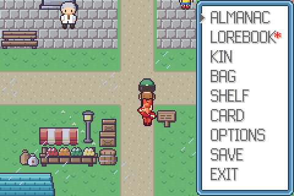
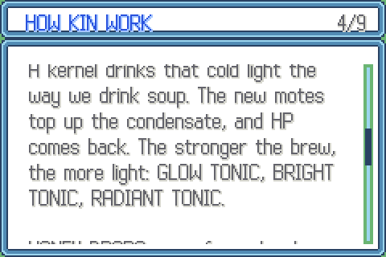

<div align="center">


# WILDKIN — The Brimming Storm

**A creature-bonding adventure for the Game Boy Advance.**<br>
Written from scratch in C, with every pixel, map and sound generated by the scripts in this repo.

[](https://github.com/DrBlury/monquest/actions/workflows/build.yml)
[**⬇ Download the ROM**](https://github.com/DrBlury/monquest/releases/latest) ·
[How to play](#-how-to-play) ·
[The world](#-the-world) ·
[Build it yourself](#-building-from-source)

</div>

---

The storm clouds over Maple Village have been grumbling for weeks. The old
Almanac says that is how it started last time: **DRAKORA**, the Stormwyrm, has
not had a bout in a hundred years and is **brimming**. Today is your
**Kindling**, the day a young villager gets a first kin and becomes a warden.
Pick a partner, explore the Vale, learn what the kin really are, and climb
Stormstone Rise to answer DRAKORA's challenge before the storm breaks.

<table>
<tr>
<td width="50%"></td>
<td width="50%"></td>
</tr>
<tr>
<td align="center"><sub>Maple Village. Your lead kin walks behind you.</sub></td>
<td align="center"><sub>Bouts. Every move has its own animation and sound.</sub></td>
</tr>
<tr>
<td width="50%"></td>
<td width="50%"></td>
</tr>
<tr>
<td align="center"><sub>Wardens challenge you when you walk into their line of sight.</sub></td>
<td align="center"><sub>The Lorebook keeps everything people tell you, sorted into chapters.</sub></td>
</tr>
</table>

## 🎮 How to play

### 1. Get the ROM

Download `wildkin-<version>.gba` from the
[**latest release**](https://github.com/DrBlury/monquest/releases/latest).
Every push to `main` also builds the ROM in CI; open a run on the
[Actions tab](https://github.com/DrBlury/monquest/actions) and download the
`wildkin-rom` artifact. Or [build it yourself](#-building-from-source) in a minute.

The ROM is free homebrew: no BIOS file, no original game and no copyrighted
data is needed or used.

### 2. Pick an emulator

| Platform | Emulator | Notes |
| --- | --- | --- |
| Windows, macOS, Linux | [**mGBA**](https://mgba.io/downloads.html) (recommended) | Open the `.gba` with *File → Load ROM*, or drag it onto the window. macOS: `brew install --cask mgba-app`. |
| Steam Deck, Linux handhelds | [RetroArch](https://www.retroarch.com/) with the **mGBA** core, or mGBA from Flathub | Keep the `.sav` next to the ROM. |
| Android | [Lemuroid](https://github.com/Swordfish90/Lemuroid) (free, mGBA core), Pizza Boy GBA, RetroArch | Put the ROM in a folder the app scans. |
| iPhone / iPad | [Delta](https://faq.deltaemulator.com/) (App Store) | Import via Files or AirDrop. |
| Real hardware | Any GBA flash cart (EZ-Flash, EverDrive GBA, ...) | The ROM declares **32 KB SRAM** saves (`SRAM_V113`), which every cart supports. |

The game runs at full speed on real hardware and in every accurate emulator.
It was developed and tested against mGBA.

### 3. Controls

| GBA button | Default key in mGBA | On the field | In menus and bouts |
| --- | --- | --- | --- |
| D-Pad | Arrow keys | Walk (tap to turn on the spot) | Move the cursor |
| **A** | X | Talk, read signs, check things, pick up satchels | Confirm, advance text |
| **B** | Z | Hold to **run** | Back, cancel, speed up text |
| **START** | Enter | Open the START menu | |
| **SELECT** | Backspace | Open the **Lorebook** | Swap mode on the Lantern Shelf |
| **L / R** | A / S | | Page up/down in long lists; switch kin on the summary; **L** in a wild bout throws your best lantern |

mGBA lets you change any of these under *Settings → Controllers*.

### 4. Saving

- **START → SAVE** saves at any time. The game keeps two save slots and
  checks them, so a save interrupted by a power cut is never lost.
- With **Autosave** on (the default), the game also saves every time you walk
  into a Hearth Hall.
- Emulators write the save next to the ROM as `wildkin-….sav`. Copy that
  file to move your game to another device.

### 5. First steps (no spoilers)

1. Start a **NEW GAME** and read the storybook. You wake up at home.
2. Walk to the **Almanac House** (the big blue roof at the top of the
   village) and talk to **Keeper Linden** to hold your Kindling. Choose
   **FLARIX** (BLAZE), **AQUAPO** (TIDE) or **DANDELAMB** (BLOOM).
3. Talk to everyone. People tell you how the world works; each new piece of
   lore is added to your Lorebook.
4. Leave the village north, east or west. Wild kin roam the tall grass:
   brimming ones run at you and want a bout. Calm, tired kin can be
   befriended with a **lantern**.
5. When you feel ready, take on **Warden Marlo** at the Bout Ring in the
   middle of the village.

<table>
<tr>
<td></td>
<td></td>
<td></td>
</tr>
<tr>
<td align="center"><sub>START menu</sub></td>
<td align="center"><sub>Every kin has its own temperament, trait, size and potential</sub></td>
<td align="center"><sub>The Almanac: habitats, level ranges, growth</sub></td>
</tr>
</table>

## 🌍 The world


| Area | What you find there |
| --- | --- |
| **Maple Village** | Home, the Old Hearth plaza, the market, the Almanac House, the Hearth Hall, the shop, the Bout Ring and the Garden House |
| **Whisper Meadow** (north) | Open grass, flower beds, ledges to hop down, the kite flyer and a shepherd with a PUFFLEECE. Wild kin Lv 2-9 |
| **Bramblewood** (east) | Dense forest, a creek with bridges, mushrooms, a hermit's cabin. Wild kin Lv 4-11 |
| **Mirror Lake** (west) | A shore with reeds, a dock and rowboat, and Dr. Vass's field station. Wild kin Lv 5-11 |
| **Stormstone Rise** | The standing stones above the meadow, where DRAKORA waits. Wild kin Lv 9-17 |

<table>
<tr>
<td></td>
<td></td>
<td></td>
</tr>
<tr>
<td align="center"><sub>Mirror Lake's dock</sub></td>
<td align="center"><sub>The creek in Bramblewood</sub></td>
<td align="center"><sub>Home, with Gran and a fire going</sub></td>
</tr>
</table>

### Why do people live with kin?

A **kin** is an animal built around a **kernel**: a pebble-sized living
crystal that holds a condensate, billions of light-matter particles (*motes*)
all sharing one quantum state. The condensate shapes and powers the body. Each
kin tops it up from one kind of energy (heat, sunlight, static, moving water,
...), and that is its **type**.

A kernel can only hold so much. A kin that is over-full **brims**, and its
surplus leaks out as heat waves, static storms, frosts and floods. When two
kin clash in a **bout**, every blow knocks motes loose. The energy soaks into
the land as warm soil and gentle rain, and a kin that runs low simply
**dozes** until it refills. Nobody gets hurt, and the weather stays kind.

That bargain is the **Kinship**: people hold the bouts and give kin names,
food and a lantern to rest in; kin share their strength and keep the seasons
gentle. It is also why answering a wild kin's challenge is good manners
("every bout is a bucket of rain," as the farmers say), and why a brimming
Stormwyrm is a problem for the whole Vale.

The in-world science is based on real physics: exciton-polariton
condensates, high-finesse optical cavities, quantum teleportation, the
no-cloning theorem and nucleation. The Lorebook explains all of it in
**75 entries** across chapters. For the full design bible (story, science,
types, all kin, moves and items) see [**docs/WORLD.md**](docs/WORLD.md).

<details>
<summary><b>How does a lantern hold a kin?</b> (spoiler-free science)</summary>

A lantern's heart is two mirrors of **heartglass**, an optical cavity with an
extremely high quality factor that can hold a condensate for years with almost
no loss. A kin's identity lives in its kernel's quantum pattern, not in its
flesh. When a calm kin *mode-matches* the cavity, the kernel and its
condensate slip inside. Motes are bosons, so all of them fit into a single
mode a few microns wide. The rest of the body (mostly water, carbon and
silica held in shape by the field) is shed as a puff of glittering mist. On
release, the re-pumped field pulls matter back out of the air and ground and
the body grows around the kernel in a second or two, the way a snowflake
grows around its seed. That is the flash when a kin comes out, and why a kin
let out in a desert is always thirsty.

Only a condensate near its ground state can make the jump without
decohering, so a fresh, struggling kin can't be caught. And any kin can
refuse by driving its own field out of tune. Catching is consent.
</details>

## 🐾 The kin


32 kin across 14 types: BEAST, BLAZE, TIDE, BLOOM, SPARK, FROST, BRAWL, VENOM,
STONE, GALE, DREAM, SWARM, DUSK and WYRM. Matchups follow the physics: water
quenches heat, charge races through water, stone grounds charge, and dusk
kin drink the light of blaze kin.

**No two kin are alike.** Every kin you meet is rolled with:

| | |
| --- | --- |
| **Potential** | Six hidden values (0-31) that the summary grades from DUD to PERFECT |
| **Temperament** | One of 16 (FIERY, STEADY, CURIOUS, DREAMY, ...): +10% to one stat, -10% to another |
| **Trait** | One of two for its species, from 21 traits such as SURGE, THICK FUR, DRIFTER, SOAKER, STATIC FUR, BASKER, MOMENTUM, QUICK STUDY |
| **Size** | TINY to HUGE; height and weight follow |
| **Lustre** | 1 in 128 kin are **lustrous**: a rare hue-shifted palette and a sparkle when they come out |
| **Bond** | Grows with bouts, steps walked together and treats. A close kin may hang on at 1 HP or shake off a status problem |

Wild kin in the same patch of grass come in a range of levels, and you can see
them wander the grass before you touch them.

## ✨ Features

- **A living overworld**: wild kin roam the grass and chase you when they
  brim, villagers walk their rounds, some people walk their kin beside them,
  and your lead kin follows you (and reacts when you talk to it).
- **Wardens with sight lines**: step into a warden's view and they spot you,
  walk up and challenge you.
- **A storm you can end**: until DRAKORA is answered the Vale is dark, rain
  falls and lightning flashes. Afterwards the sky clears.
- **Five areas and eight interiors** dressed with 121 kinds of furniture and
  outdoor details: fireplaces, brick ovens, pianos, aquariums, lantern racks,
  market stalls, docks, rowboats, tents, beehives, weather vanes and more.
  Many are animated, and most say something when you examine them.
- **Bouts that feel good**: 74 moves, each with its own animation. Blows
  freeze for a beat, flash, squash the target and shake the screen (harder on
  weak spots and perfect strikes). Big moves tint the sky with their type, HP
  bars drain smoothly and change colour, and every bout opens with the field
  dissolving into a ring of lantern light. Sound effects play on the GBA's
  own sound channels.
- **Rules with depth**: five status problems (BRN, PSN, NMB, SLP, FRZ),
  perfect strikes, stat stages, priority, draining, recoil, multi-hit and
  healing moves. 21 traits trigger visibly in bouts, and the AI plays around
  them.
- **The Lorebook**: a scrollable knowledge base with chapters. Lore unlocks
  as you talk to people and examine things, and you can re-read it any time
  with SELECT.
- **The Almanac**: every kin with its description, stats, growth, move list
  and where it lives (with level ranges and how rare it is).
- **Growth**: kin grow into new forms at a level or when they touch a
  **shard** (BLOOM, SPARK, DUSK, FROST).

<table>
<tr>
<td></td>
<td></td>
<td></td>
</tr>
<tr>
<td align="center"><sub>The move menu shows uses, type and matchup</sub></td>
<td align="center"><sub>Potential grades; the temperament colours its stats</sub></td>
<td align="center"><sub>A Lorebook page</sub></td>
</tr>
</table>

### Quality of life

- Run with **B** from the start; hold A or B to speed up text.
- **Options**: text speed (4 settings), bout animations, sound, follower and
  autosave.
- The whole team earns XP (the bench gets half), and befriending a kin also
  gives XP.
- The move menu tells you when a move will strike a weak spot, or be shrugged
  off, against the current foe.
- **L** in a wild bout throws your best lantern.
- The wild HUD shows a lantern icon when you have already befriended that kin.
- The **Lantern Shelf** (your storage) is reachable from the START menu once
  you have the TWIN CRYSTAL.
- Keeper Linden can re-teach moves your kin forgot.
- **HUSH BELL** keeps wild kin away for a while.
- The summary shows temperament, trait, potential grades, size, bond and
  where and when you met each kin.
- Beds heal your team; Hearth Halls heal and autosave.
- Two checked save slots; older saves are migrated automatically.

## 🛠 Building from source

You need a bare-metal ARM GCC, Python 3 (standard library only) and
[`gbafix`](https://crates.io/crates/gbafix). No devkitPro install is needed.

**macOS**

```bash
brew install arm-none-eabi-gcc arm-none-eabi-binutils
```

```bash
cargo install gbafix
```

**Debian / Ubuntu**

```bash
sudo apt install gcc-arm-none-eabi binutils-arm-none-eabi python3 cargo
```

```bash
cargo install gbafix
```

Then:

```bash
make
```

That writes `game.gba`. Other targets:

| Command | What it does |
| --- | --- |
| `make run` | Build and open the game in mGBA |
| `make test` | Build and run the host-side test suites (rules, bouts, maps, reachability, menus, saves, a balance simulation) |
| `make art` | Regenerate every art header from the Python generators |
| `make maps` | Render every map to `build/maps/*.png` |
| `make shot` | Build the headless screenshot harness (needs libmgba: `brew install mgba`) |
| `python3 tools/make_media.py` | Re-record every GIF and screenshot in this README |
| `make clean` | Remove build output |

### How it is made

- **Unity build.** `src/main.c` includes every module in `src/game/`. The
  tests compile the same file on the host with the hardware registers,
  VRAM, OAM and SRAM mapped to plain arrays, so they can drive whole screens
  and bouts frame by frame.
- **Generated art.** Every tile, sprite, palette and particle is drawn by
  Python scripts in `tools/` (a small 3D-primitive renderer for the kin, a
  pixel-art toolkit for terrain and decor). The output is deterministic 4bpp
  data in `src/gfx_*.h`, and CI checks that it is up to date.
- **Graphics.** Mode 0 with four layers: ground, a transparent decor layer,
  a top layer that draws tree tops and roofs over the player, and a bitmap
  canvas for text and menus with a variable-width font. Decor tiles are
  loaded per map to fit the 512-tile budget.
- **Media.** `tools/shot.c` runs the ROM headless in libmgba from a script
  of inputs and writes PNGs. `tools/make_media.py` builds demo saves, records
  clips and encodes the GIFs with a small pure-Python GIF encoder.

<details>
<summary><b>Project layout</b></summary>

```
src/main.c              unity build root, main loop, frame presenter
src/game/gba.h          registers (plain memory on the host), input, RNG, strings
src/game/data.h         types, type chart, traits, temperaments, 32 species, items
src/game/moves.h        74 moves (+ LAST GASP) and their animation recipes
src/game/lore.h         the 75 Lorebook entries, chapters and the intro storybook
src/game/options.h      player options (saved with the game)
src/game/monster.c      stats, potential, temperament, XP, learning, growth
src/game/party.c        team, Lantern Shelf storage, bag, coins, move learning
src/game/gfx.c          UI canvas, variable-width text, windows, bars, sprites
src/game/msg.c          typewriter message box, choices, dialog queue
src/game/battle.c       bout rules that queue presentation events
src/game/battle_ui.c    event playback, HUD, bout menus, transitions
src/game/anim.c         move animation patterns
src/game/sfx.c          sound effects on the GBA's PSG channels
src/game/field.c        maps, decor, movement, ledges, followers, wild kin, weather
src/game/maps.h         every map, decor placement, person, warden, sign and satchel
src/game/script.c       people, story, wardens' sight lines, examining things
src/game/menu.c         START menu, card, team, summary, bag, shop, shelf, options
src/game/dex.c          the Almanac
src/game/lorebook.c     the Lorebook
src/game/evolve.c       growth scene
src/game/title.c        title screen and storybook
src/save_game.h         two verified SRAM slots and save migration
src/mem.c               memcpy/memset for the freestanding build
src/crt0.S, gba.ld      startup code and memory map
src/gfx_*.h             GENERATED art
tools/gen_*.py          art generators (UI, kin, field, bout)
tools/decor_*.py        the decor catalogue (indoor and outdoor)
tools/terrain_*.py      terrain tiles and autotiles
tools/test_field.c      maps, reachability, movement, people, lore, menus, saves
tools/test_game.c       rules, bout timeline, learning, growth, balance simulation
tools/shot.c            headless mGBA harness: scripted input -> PNG
tools/make_demo_save.c  builds mid-game saves for screenshots and playtests
tools/make_gif.py       pure-Python PNG reader and GIF encoder
tools/check_rom.py      validates the ROM header
tools/render_maps.py    draws every map exactly as the game does
tools/render_gallery.py the kin gallery above
tools/make_media.py     re-records the README media
docs/WORLD.md           design bible: story, science, kin, moves, items
```
</details>

### Debugging

mGBA has a GDB stub (*Tools → Start GDB server*, port 2345):

```bash
arm-none-eabi-gdb game.elf -ex "target extended-remote :2345"
```

Useful references: [Tonc](https://www.coranac.com/tonc/text/toc.htm),
[GBATEK](https://problemkaputt.de/gbatek.htm) and the
[mGBA docs](https://mgba.io/docs.html).

## License

[MIT](LICENSE). WILDKIN is an independent fan-made homebrew project and is not
affiliated with Nintendo or any other game company.
