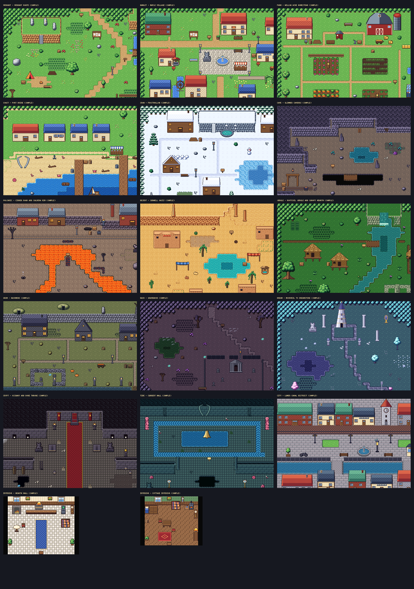

# Second-generation tile sets

Generated by `python3 tools/tiles2/build.py`; do not edit by hand. The format, palette rules and integration plan are in [docs/TILES2.md](../../docs/TILES2.md).

| Set | Replaces | Entries | 8x8 tiles (terrain) | Banks | Colours | Palette variants | Sample maps (resident tiles / 768) |
| --- | --- | ---: | ---: | ---: | ---: | --- | --- |
| [verdant](verdant/verdant_sheet_x3.png) | `wild` | 111 | 1245 (517) | 8 | 67 | autumn, spring | [Verdant route (sample)](verdant/scene_route_x2.png) 631 |
| [hamlet](hamlet/hamlet_sheet_x3.png) | `town` | 108 | 1458 (374) | 8 | 80 | autumn, dusk | [Maple Village (sample)](hamlet/scene_village_x2.png) 728 |
| [farm](farm/farm_sheet_x3.png) | `farm` | 84 | 800 (220) | 8 | 83 | autumn, spring, winter | [Willow Acre homestead (sample)](farm/scene_homestead_x2.png) 510 |
| [coast](coast/coast_sheet_x3.png) | `coast` | 79 | 1241 (499) | 8 | 66 | storm | [Port Brine (sample)](coast/scene_port_x2.png) 549 |
| [snow](snow/snow_sheet_x3.png) | `snow` | 67 | 1157 (449) | 8 | 45 | night | [Frosthollow (sample)](snow/scene_frosthollow_x2.png) 479 |
| [cave](cave/cave_sheet_x3.png) | `cave` | 46 | 499 (307) | 7 | 48 | deep | [Glimmer Caverns (sample)](cave/scene_glimmer_x2.png) 275 |
| [volcanic](volcanic/volcanic_sheet_x3.png) | `volcanic` | 59 | 1073 (278) | 8 | 42 | eruption | [Cinder Road and Caldera rim (sample)](volcanic/scene_caldera_x2.png) 462 |
| [desert](desert/desert_sheet_x3.png) | `desert` | 51 | 611 (325) | 6 | 47 | dusk | [Sunwell oasis (sample)](desert/scene_sunwell_x2.png) 401 |
| [jungle](jungle/jungle_sheet_x3.png) | `jungle` | 51 | 742 (364) | 6 | 39 | dusk | [Rootcoil Jungle and Canopy Hearth (sample)](jungle/scene_rootcoil_x2.png) 466 |
| [grim](grim/grim_sheet_x3.png) | `grim` | 60 | 954 (358) | 7 | 43 | night | [Duskmere (sample)](grim/scene_duskmere_x2.png) 498 |
| [dusk](dusk/dusk_sheet_x3.png) | `dusk` | 55 | 900 (351) | 8 | 41 | moonlit | [Gravewood (sample)](dusk/scene_gravewood_x2.png) 306 |
| [dream](dream/dream_sheet_x3.png) | `dream` | 53 | 866 (331) | 7 | 39 | dawn | [Moonveil to Dreamspire (sample)](dream/scene_moonveil_x2.png) 300 |
| [crypt](crypt/crypt_sheet_x3.png) | `crypt` | 32 | 265 (108) | 6 | 36 | lit | [Ossuary and Bone Throne (sample)](crypt/scene_ossuary_x2.png) 202 |
| [tide](tide/tide_sheet_x3.png) | `tide` | 37 | 435 (254) | 5 | 32 | biolume | [Current Hall (sample)](tide/scene_current_hall_x2.png) 205 |
| [city](city/city_sheet_x3.png) | `city` | 42 | 979 (162) | 8 | 70 | night | [Lumen canal district (sample)](city/scene_lumen_x2.png) 614 |
| [interior](interior/interior_sheet_x3.png) | `interior` | 104 | 691 (61) | 8 | 54 | evening | [Hearth Hall (sample)](interior/scene_hearth_hall_x2.png) 127, [Cottage interior (sample)](interior/scene_cottage_x2.png) 134 |

Each set directory holds `<set>.png` (the sheet, exact GBA colours), `<set>.json` (manifest), `<set>@<variant>.png` (palette variants), `<set>_sheet_x3.png` (labelled review sheet) and `scene_*.png` sample maps (1x, 2x and per variant).
