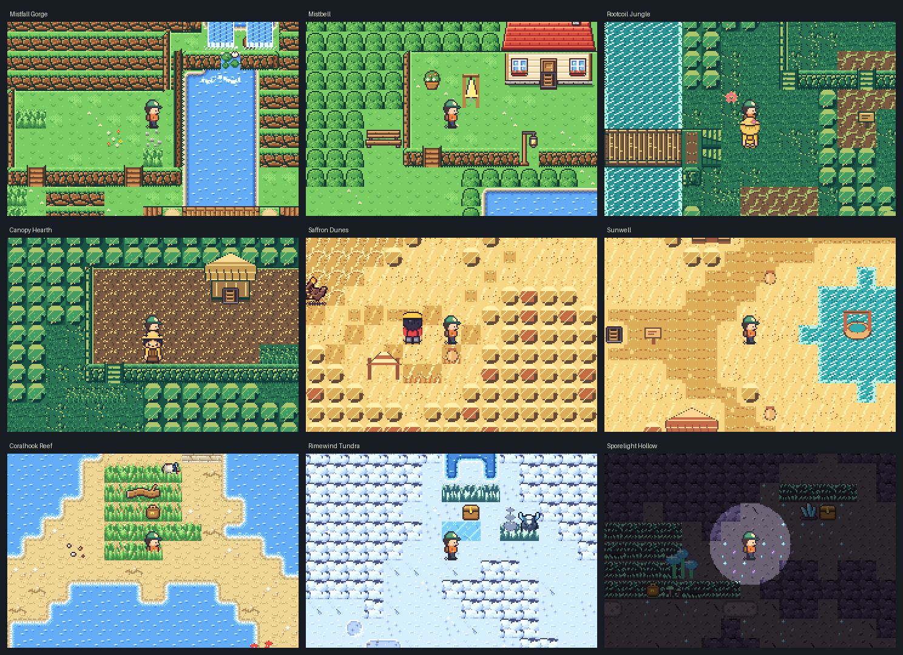
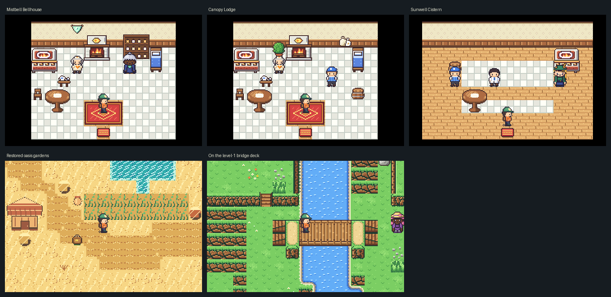

# Biome journeys and villages

This expansion adds twelve playable maps, three village quests, dedicated desert
and jungle graphics, and a scenery/character pass over nineteen existing areas.
It coexists with the connected-cave expansion in [UNDERWORLD.md](UNDERWORLD.md).

## Where to go

Coordinates are zero-based authoring coordinates. In play, look for the visible
ladder/entrance marker and nearby route signs. The parent region's original
story gates still apply; none of these branches bypasses a Hall.

| Parent entrance | New journey | Local requirement |
| --- | --- | --- |
| Brookmill (12,30) | Mistfall Gorge → Mistbell → Mistbell Bellhouse | Reach Brookmill normally |
| Elderwood Heart (20,20) | Rootcoil Jungle → Canopy Hearth → Canopy Lodge | Reach Elderwood through its existing traversal gate |
| Scorchwaste (40,16) | Saffron Dunes → Sunwell → Sunwell Cistern | Lantern Crest, checked in both directions |
| Sea Route (10,30) | Coralhook Reef | Tide Crest; optional surf channels use normal SURF |
| Aurora Crest (44,14) | Rimewind Tundra | Rime Crest, plus the existing Aurora access gates |
| Glimmer Caverns (11,17) | Sporelight Hollow | Rime Crest |

The three villages become FLY destinations after discovery. Their landing pads
are clear ground, separate from signs and entrance triggers. Outdoor destinations
have surface-map markers and nonoverlapping world-layout hints; Sporelight uses
the existing underground atlas and Frosthollow surface anchor.

## Landscapes and encounters

- **Mistfall Gorge:** a raised source pool and animated waterfall, separated
  terraces, a bridge over the river, a shelter pocket, and an elbow-shaped hidden
  shelf behind the spray. Hiker Ell's after-bout clue points toward the secret;
  its glow lantern and discovery state are saved. A second reward sits on the
  lower terrace. The western rock barrier changes the actual walkable route.
- **Rootcoil Jungle:** broadleaf and buttress-root silhouettes, hanging vines,
  orchids, a raised river bridge, a northern canopy arc and a southern ruin
  terrace. The high arc has its own stair; it is not a recolored copy of the gorge.
- **Saffron Dunes:** broken sandstone banks enclose the dry wash, a caravan
  shelter and a harder ridge-cache detour. Cactus, dry sedge and water jars use a
  dedicated warm palette rather than the forest tiles.
- **Coralhook Reef:** a hooked sandbar route, surf channel, branching coral,
  driftwood, shell beds and a wreck-side warden. Its coastal kin and trainer
  levels match the Sea Route rather than late-game snow encounters.
- **Rimewind Tundra:** a treeless, cairn-guided route through wind-shaped banks,
  with a sheltered battle hollow and an icy overlook.
- **Sporelight Hollow:** irregular chambers around a glowing pool, fungal
  shelves, mineral clusters and a guarded reward alcove. The native ROM retains
  its lantern-darkness effect; full-map overview images intentionally do not.

Every new wilderness map has a reachable encounter habitat, named wardens and
optional rewards. Battle entry, victory recording and return to the same map are
covered by `test_biome_integration.c`; this is not a claim of a full campaign
balance playthrough.

## Village customs and quests

| Village | Visible identity and custom | Interaction |
| --- | --- | --- |
| Mistbell | Cliffside storehouses, drying laundry, rain barrels and a signal bell; bell patterns carry above the falls | In the Bellhouse, offer **2 Iron Ore** to repair the bell. Gain **2 Big Tonics** and open the shelter return shortcut. Healing is available inside. |
| Canopy Hearth | Raised woven homes, root platforms, herb patches and leaf-pattern wayposts | Offer the waymarker weaver **3 Glowcap**. Gain **1 Revival Brew** and open the lower-root shortcut. The Lodge offers healing and supplies. |
| Sunwell | Adobe homes around an irregular oasis; household jars and communal irrigation | In the Cistern, offer **2 Iron Ore + 1 Metal Shard**. Gain **2 Grand Tonics** and permanently restore the garden beds. The Cistern also offers healing and supplies. |

Repairs require confirmation. Cancellation, missing materials and a full reward
stack do not consume supplies. Completion and rewards are one-time and survive
save/load. Houses use the game's normal single-room exit mats; outdoor branches
use explicit paired ladder portals, never hidden automatic floor triggers.

## Existing-area pass

Brookmill Trail, Saltwind, Frostpine and Moonveil have new solid terrain pinches
with tested detours, plus fitting existing prop clusters. Established bridge,
portal, event and story coordinates remain intact—including the travelling
merchant's Saltwind clearing and Brookmill's Field Notes guide.

The broader nineteen-area pass adds terrain-material detail and local flavor to
Brookmill, Heron Fen, Reedwick, Port Brine, Gull Isle, Timberline, Frosthollow,
Ember Tunnel, Caldera, Cindermoor, Railhead, Dreamspire, Hollow Downs, Gravewood
and Duskmere. Ten settlement conversations describe working customs: mill-wheel
music, reed weaving, net mending, shell-grit gardens, the thawed sawmill flume,
geothermal warmth, forge sounds, night shifts, moon gardens and memorial lanterns.
Existing cities keep their established architecture and story-service locations;
this is not a wholesale rebuild of every old town or interior.

## Authoring and compatibility

- New data lives in `src/game/world/{east,links,west,north}/biomes/`, included at
  the end of each owning region's lists. Existing saved ID prefixes are retained.
- `tools/world_includes.py` lets the save-manifest generator follow those local
  includes in compiler order; missing files, cycles and root escapes fail loudly.
- `desert` and `jungle` are appended after `dusk` in the tileset registry. Source
  graphics are in `tools/biome_art.py`, `tools/decor_biomes.py` and their tileset
  modules. Generated headers are regenerated, not hand-edited.
- The Makefile watches nested biome files so editing a route rebuilds the ROM.
- Existing invalid-position recovery is reused: unsafe old terrain positions
  recover at a safe entrance or Hearth, while valid deck and surf positions stay
  intact. No binary save-version change is needed.
- Tile-grid storage remains rectangular, but collision contours define the
  playable shape. No freeform movement, survival meter, diving or new combat
  engine is introduced.

## Reproducing checks and captures

```
make test
make
make maps
make shot
python3 tools/capture_biomes.py
python3 tools/tests/test_save_layout_includes.py
python3 tools/tests/test_world_includes.py
python3 -m unittest discover -s tools/biome_redesign -p 'test_*.py'
```

The capture tool only creates disposable files beneath
`build/biome-validation/rom`. It checks the running ROM's map, player position,
elevation and FIELD mode before accepting each image. It also walks onto the
raised Mistfall bridge and verifies level 1. It does not use a player's save.





## Observed integration results

- Stable baseline and final `make test` both exited 0. The final run completed
  **53 host test executables**, including all four new biome suites.
- Include-reader and guarded-authoring Python tests: **13 passed**.
- Scene residency covered **200 maps**, including test/viewer maps; peak
  **511/768 tiles**, with no overflow.
- Puzzle proof: **190 map/ability combinations**, **41 strict cave-entry
  searches**, no unreachable targets or soft-locks.
- `make` produced a valid **3,790,668-byte** ROM without compiler warnings.
- `make maps` rendered **139 non-viewer maps**; world-layout rendering reported
  no overlaps. Fourteen ROM captures verified map, position and field mode.
  The bridge probe reached **(17,14), level 1**, inside the authored bridge.
- A genuine pre-expansion version-7 save retained map/position, kin origin,
  inventory, money, visits, 21 puzzle bits and all 16 old secrets.

Initial integration checks caught and fixed blocked stair approaches, invisible
wayfinding props, full-bag reward loss, warden sightlines facing walls, occupied
FLY landings, cross-region event placements and exit-mat flags beneath explicit
ladders. None of those failures was waived. This validates the expansion, not a
complete campaign playthrough or testing on physical GBA hardware.
