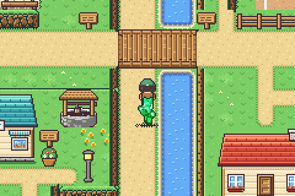
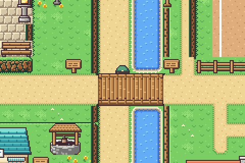
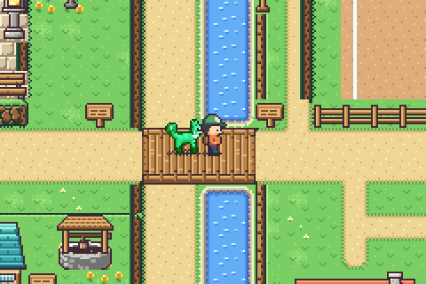
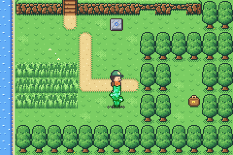
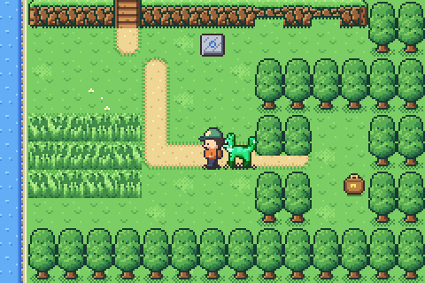
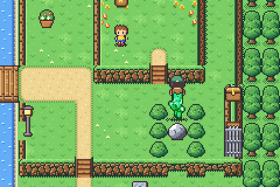
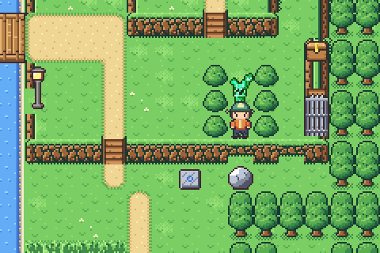
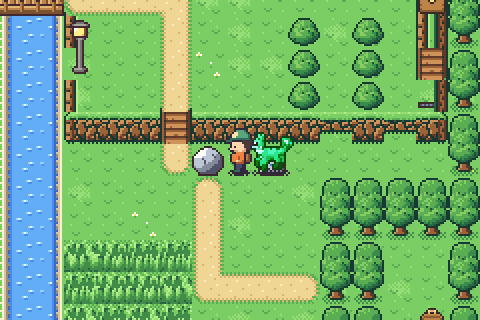

# Elevation: heights, cliffs, stairs, bridges, tunnels and secrets

Maps can have **height**: plateaus with cliff faces, stairs and ledges
between levels, bridges you walk **over** one way and **under** the other,
tunnels under a plateau and hidden passages through trees or rock. This
document is the authoring reference; the engine is `src/game/elev.c`, the
art `tools/elevation.py`, the tests `tools/tests/test_elevation.c`.

Two maps show everything:

- **TEST HEIGHTS** (`src/game/world/elev/data.h`, debug WARP menu): every
  feature on one small map.
- **MAPLE VILLAGE** (`src/game/world/village/data.h`): a real town built
  with it (four levels: the road over the Maple Run bridge and the lane
  under it in the creek ravine, a stepped wooded ridge and a knoll over
  two-row faces, a raised plaza, a sunken bout ring, a terrace with a
  jutting edge over the pond dell, a mill pond, a ledge yard and a hidden
  gap in a thicket).

| in front of the bridge | under it | on it |
| --- | --- | --- |
|  |  |  |

---

## 1. The model in one paragraph

Every cell has a **ground height** 0-3 (the elevation layer). The game is
drawn in 3/4 view, so a raised area shows its **cliff face** in the rows
just **south** of it: one row of face per level of drop. Faces are derived
automatically from the heights — you never draw them. East, west and north
edges of a raised area show a rock **rim** on the high cells (and a cast
shadow on low ground to the east). Actors (player, people, their kin, the
follower, wild kin) stand on a **level**; they walk between cells of the
same height, change level only on **stairs**, hop **down** over **ledges**,
and cross **decks** (bridges) and **tunnel tops** one level above the
ground below them.

---

## 2. Giving a map a height layer

In the region's `data.h`, next to the rows (same width and height):

```c
/* heights (0-3), stairs (^ v < >) and ledges (_) */
static const char *const MYTOWN_ELEV[] = {
    "1111111111", /*  0 */
    ...
};

static const ElevFeat MYTOWN_FEATS[] = {
    EF(BRIDGE_H, 12, 9, 4, 2),   /* x, y, w, h */
    EF(HIDDEN, 24, 19, 2, 1),
};
```

and at the end of the map's entry in `maps.inc` (designated initializers,
after the link offsets):

```c
[MAP_MYTOWN] = { 40, NROWS(MYTOWN_ROWS), TS_CITY, SC_CITY, MYTOWN_ROWS, ..., { links }, { 0, 0, 0, 0 },
                 ELEV(MYTOWN_ELEV, MYTOWN_FEATS) },
```

`ELEV_ONLY(MYTOWN_ELEV)` gives a layer without features. A map without a
layer is flat (height 0 everywhere) and behaves exactly as before. The
tileset must carry elevation art (section 8): town, wild, city, coast,
farm, snow, cave, volcanic, dream and grim do.

### 2.1 The elevation characters

| char | meaning |
| --- | --- |
| `0` `1` `2` `3` | ground height of the cell |
| `^` | stairs climbing **north**: join the cell south of them (their low side, its height) to the cell north of them (one higher) |
| `v` | stairs climbing **south** (low side north) |
| `<` | stairs climbing **west** (low side east) — side stairs along a cliff |
| `>` | stairs climbing **east** (low side west) |
| `_` | a **ledge**: a cliff face you may hop down (southward) but never climb; its height is the one of the cell below it |

Stairs take the height of their low-side neighbour; the cell on their high
side must be exactly one higher. Several stairs of the same direction in a
row are a staircase: each one starts where the previous one ends (so `^` `^`
under a 2-high cliff climb from 0 to 2).

### 2.2 Features (rectangles over the layer)

`EF(KIND, x, y, w, h)`; the digits under a feature give the **ground** (the
lower level); the feature adds its upper level (ground + 1).

| kind | what it is |
| --- | --- |
| `BRIDGE_H` | a bridge deck walked **east-west** on top. Underneath, the ground is walkable as usual (north-south along a gorge, or by surf on water). Both ends of the deck must meet ground at the deck's height. Make it 2 rows tall: the actor under the lower row is hidden entirely, and the look (railings + front beam) is made for it. |
| `BRIDGE_V` | the same, walked **north-south** on top. |
| `TUNNEL` | cells under a plateau: their top (ground + 1) is walkable in every direction like the plateau around it, and drawn over anyone inside; the tunnel floor is the ground digit. Write the ground height (e.g. `0`) in the tunnel column, the plateau height (`1`) around it. The cliff face just south of the tunnel becomes its **mouth** automatically. The tunnel's north end opens onto whatever lower ground is north of the plateau. |
| `HIDDEN` | a secret passage: whatever the rows show there (trees, a cliff face, a wall), the cells are walkable at their ground height and drawn **over** the walker. The first time the player steps into any of its cells, a rustle and a "!", and the whole rectangle is **found for good** (saved): from then on it shows a worn gap (section 5.6). Put a subtle hint next to it (a path stub, pebbles). |

### 2.3 Derived things (never written)

- **Faces.** Walking down each column, a cell whose ground is lower than
  the surface drawn just above it is a cliff face (solid); the surface
  drawn there is one lower. So a plateau at height 1 ending at row 9 gets a
  face on row 10; a plateau at height 2 gets faces on rows 10 and 11.
  **The face rows are part of the lower area** — write the lower digit
  there, and keep them free of people, doors, signs and decor. Terrain
  under a face is hidden (write `.`); don't put trees there.
- **Mouths.** A face right under a `TUNNEL` cell is its open mouth.
- **Ledges** only count where there is a rise right above them; a `_`
  without one is plain ground (the lint test complains).

---

## 3. Movement rules

| from \ to | same height ground | other height ground | stairs | deck / tunnel top |
| --- | --- | --- | --- | --- |
| ground at L | yes (terrain rules apply) | no (cliff) | only from its low end at L or its high end at L+1 | only at L = deck level, and a bridge only from its ends (along its axis) |
| stairs | leaving toward its high side: onto L+1; toward its low side: onto L; never sideways | | | |
| deck (on top) | a bridge only along its axis; its railings stop you | | | |

- **Ledges**: stepping south onto a `_` from the rise above it hops two
  cells down (like the old ledge tiles); from below it is a wall.
- **Under a deck** the terrain decides as usual (a path is walkable, water
  needs SURF).
- **Tunnel**: inside at the ground level; walls on both sides (the plateau
  is one higher); out through the mouth or the north end.
- People and kin block only actors on their own level: someone under a
  bridge doesn't block the deck. Wandering people never step onto another
  height except by stairs, and never into hidden passages. Wild kin keep to
  their level and can't charge you across a cliff; wardens can't spot (or
  walk at) you across one.
- **Talking and taking**: people, kin and satchels across a cliff or on
  another level are out of reach (a satchel on a mesa can't be picked from
  below). Signs can be read across levels.
- **Edges and warps**: an arrival cell's level is derived (the ground if it
  is walkable, else the deck; on a bridge cell, facing along the bridge
  means the deck). Neighbouring maps don't share levels: an edge opening
  just has to be walkable on both sides (the edge contracts,
  docs/EXPANSION.md 9).
- **Save**: the level is stored (`SaveData.level`, level + 1; 0 = derive
  it, as older saves do); a saved position on a bridge cell comes back on
  the right side of the deck. Found hidden passages are bits in the travel
  module blob (`TravelState.secrets`, section 7).

### 3.1 Puzzles and farms on heights

Map objects (`MapDef.objs`) and puzzle tiles are level-aware. Every object
stands on a **level**: the ground of its cell (a boulder placed on a bridge
cell over water starts on the deck).

| piece | on heights |
| --- | --- |
| boulder | keeps its level. It can't go up or down **stairs**, can't be pushed off a **cliff edge** (the rim stops it) and never goes onto a face, a ledge, a tunnel mouth or into a **hidden** passage. Pushed **south off a ledge** it **drops** to the ground below and lands on the cell past the ledge, like a hopping player (so it can only come back up by reloading the map). Along a **bridge**: a boulder on the deck is pushed along the deck by someone on the deck; one on the ground under it by someone underneath; a walker on the other level passes it by. Over a **tunnel** top the same. |
| plate | pressed only by a boulder on its own level (a boulder rolled along a deck over a plate doesn't press it) |
| switch | pressed only by a player on its level (not by someone crossing a deck above it) |
| gate / barrier | solid only on their level |
| ice | slides stop at any height change: the ground rising or falling away, stairs, a ledge or a deck end; ice on a terrace works like flat ice. Someone on a deck above ice doesn't slide. |
| current | carries you on your level only and stops at a height change |
| teleport pad | puts you on its **partner's** level: pads may join terraces |
| farm plot (WILLOW ACRE) | its terrace is its ground height (`plot_lv`); tools reach only plots on your level (a plot below a terrace edge is out of reach, like a person); sprinklers water the plots of their own terrace; workers wander their own terrace |

Authoring: objects other than boulders stand on plain ground (not on a
face, stairs, a ledge, a hidden cell or up on a deck); the elevation puzzle
test lints this. Chests, legends and ferries are used like people: never
across a cliff or from under a deck.

---

## 4. Drawing (what goes on which layer)

| layer | elevation content |
| --- | --- |
| BG0 (prio 3) | the ground from the rows, as always (also under faces and decks) |
| BG2 (prio 2) | cliff faces, ledges, stairs, tunnel mouths, plateau rims, cast shadows. **Decor and tree trunks on a cell win over rims** — keep decor off rim cells where you want a clean edge (it looks fine on the inner cells). |
| BG3 (prio 1) | bridge decks, tunnel tops (the tileset's ground), hidden cells' art |
| OBJ | people and kin: priority 2 normally (under BG3), **1 on a deck or tunnel top** (over it) **and just south of one** (in front of it). Under a deck they are hidden by it; inside a hidden passage the trees are drawn over them. Grass blades and ground shadows follow the actor's priority (no blades over someone on a deck). |

Autotiling is per 8x8 quadrant like the paths: rims know inner and outer
corners, faces round off their ends (caps) where the face stops, so
irregular, stepped and diagonal-ish plateau outlines work — try them.

---

## 5. Recipes

Rows on the left, heights on the right. `.` grass, `=` path, `~` water,
`T`/`t` tree top/trunk.

### 5.1 A plateau with stairs

```
..........   0000000000
.========.   0111111110      row 1-3: the plateau (height 1)
.=......=.   0111111110
.=......=.   0111111110
.=.......    0000^00000      row 4: its face, derived; '^' = stairs up
.=.......    0000000000
```

The stairs cell (4,4) joins (4,5) at height 0 to (4,3) at height 1. Put a
path through it in the rows for a nicer look (it is hidden under the stairs
art anyway).

### 5.2 A 2-high cliff with a staircase

```
2222222222
2222222222
0000^00000     rows 2-3: the two face rows of the 2-high cliff (write the
0000^00000     low side's height there); the stacked stairs climb 0 -> 1 -> 2
0000000000
```

### 5.3 Ledges

```
1111111111
0000___000     hop down from row 0 onto row 2 at x 4-6; the rest is a wall
0000000000
```

### 5.4 A bridge over a gorge (over one way, under the other)

```
..==~~....   1100001111      the gorge (x 2-5): a lane (=) and a stream (~)
..==~~....   1100001111      at height 0 between plateaus at height 1
====~~====   1100001111      the road on both plateaus; the deck (rows 2-3)
====~~====   1100001111      spans the gorge
..==~~....   1100001111
```
```c
EF(BRIDGE_H, 2, 2, 4, 2),
```

Walk the road east-west over the deck (level 1); walk the lane north-south
under it (level 0). The plateau edges along the gorge get rims, the lane a
cast shadow. Maple Village's ravine and bridge are this recipe.

### 5.5 A tunnel under a plateau

```
......   000000
......   110111      column 2: the tunnel floor (0) inside a plateau (1)
......   110111
......   110111
......   000000      row 4: the plateau's face; (2,4) becomes the mouth
```
```c
EF(TUNNEL, 2, 1, 1, 3),
```

### 5.6 A hidden passage

```
TTTTTT
tttttt     -> EF(HIDDEN, 2, 1, 2, 1): walk east through the trunks at
..=...        (2,1)-(3,1); a path stub or pebbles make a fair hint
```

Hidden cells also work in a cliff face (a secret cave: `HIDDEN` over the
mouth cell of a `TUNNEL`) or in a wall of rocks.

Once found (saved for good), a passage changes its look so returning
players can see it: the lower half of each cell (and the whole cell further
down a north-south passage) becomes a **worn gap**, the tileset's path
joined to any path beside it, under the trees' crowns; a crack in a cliff
face becomes an open **cave mouth**.

| not found | found |
| --- | --- |
|  |  |

### 5.7 A puzzle on a terrace

TEST HEIGHTS (east plateau): a pumice boulder in a chute of bushes on the
plateau (height 1), a ledge below the chute, a plate on the ground below
(height 0) and a gate at the foot of the stairs up a knoll (height 2) with
a chest. Push the boulder down the chute and off the ledge (it drops a
level), hop down the other ledge, push it west onto the plate: the gate
sinks.

```
  x 23 24 25 26 27
    .  .  .  .  2     row 10  the knoll (height 2) and its chest
    B  .  B  .  2     row 11  B: bushes; the boulder starts at (24,12)
    B  o  B  .  ^     row 12  stairs up the knoll
    B  .  B  .  G     row 13  G: the gate (height 1)
    |  _  |  _  |     row 14  ledges at x 24 and 26 ('|' faces)
    .  .  .  .  .     row 15  the ground (height 0); the plate is at (22,15)
```

The chute keeps the boulder away from the gate and the rest of the plateau
(a boulder that can roam a whole terrace can jam it); a boulder dropped off
a ledge can never come back up, so give it room below.

| start | dropped off the ledge | on the plate, the gate sunk |
| --- | --- | --- |
|  |  |  |

### 5.8 Pits, mounds, bluffs and silhouettes

- A **sunken arena**: a rectangle of `0` inside a `1` terrace; its north
  wall is a face (put `^` steps in it), the other sides are rims. (Maple
  Village's Bout Ring.)
- A **raised plaza**: a rectangle of `2` on a `1` terrace, `v` stairs on
  its north side, `^` stairs in its south face. (The Hearth mound.)
- A **wooded ridge / bluff** at the map border: trees on a higher strip;
  its face shows below the tree line and breaks the rectangular frame.
  Vary its depth (jut out a few cells here and there).
- **Irregular outlines**: step plateau edges by a cell or two every few
  columns (diagonal-ish), let water reach the map edge, carve dells.
  Faces cap themselves where they end and rims turn corners.

---

## 6. Checklist for redesigning a town

1. Keep every door, NPC, sign, satchel, fly point and warp working: move
   their coordinates consistently (`warps.inc`, `npcs.inc`, `signs.inc`,
   `satchels.inc`, `flypoints.inc`, stamps and decor in `data.h`, and any
   other region's files that point into your map — e.g. the Land Office
   warp and sign of Maple Village live in `world/east/`).
2. Keep the edge openings (the edge contracts, docs/EXPANSION.md 9): the
   same walkable x (north/south) or y (east/west) as before; every other
   edge cell must be a wall, water or a face.
3. Doors: the cell in front of a door (south) must be walkable ground on
   the door's level. Signs must stand on a solid cell (signpost decor or a
   wall) and be reachable from beside it.
4. Don't put people, satchels, signs or decor on face rows, and no tall
   grass under decks.
5. `make maps` then look at `build/maps/<id>_<name>.png`;
   `python3 tools/render_maps.py build/lv --levels <name>` prints every
   cell's height (white ground, red faces and ledges, green stairs with
   their top level, blue decks and tunnels with their top level, magenta
   hidden cells) over the picture.
6. `make test`: the reachability test floods every map level-aware (people,
   satchels, signs, doors, exits and grass must be reachable), the
   elevation lint checks stairs, ledges and bridges, and the tile budget
   test checks tileset + decor ≤ `SCENE_TILE_MAX` (768) tiles. Grep the tests for your map's
   coordinates (`tools/test_field.c`, `tools/tests/*.c`) and update them.
7. In the ROM: `make shot` and a demo save
   (`build/make_demo_save OUT.sav MAP_ID X Y calm`, see
   `tools/make_media.py`) to screenshot the player under and on a bridge;
   `tools/make_media.py elevation` does it for Maple Village.

---

## 7. Engine reference (src/game/elev.c)

- `map_elev[]` (EWRAM, u16 per cell): ground (2 bits), deck/tunnel height
  (2), drawn height (2), kind (ground / face / ledge / stairs + direction),
  cover (bridge H/V, tunnel, mouth, hidden), found flag.
- `elev_decode()` (from `map_decode`), `elev_attr()` (faces solid, ledges
  `A_LEDGE`, stairs / mouths / hidden open — used by `cell_attr_raw`, so
  every legacy check sees faces as walls).
- `elev_enter(x, y, level, dir, &level_out)` → `ELEV_BLOCK`, `ELEV_FLOOR`
  (terrain applies) or `ELEV_TOP` (a deck: terrain below ignored).
- `elev_level_at(x, y, hint, facing)`: the level to stand on.
- `elev_obj_prio(actor)`: OBJ priority 1 or 2.
- `elev_render_base()` / `elev_render_cover()`: called by `render_cell`
  before and after decor.
- Actors have `Actor.level`; `cell_walkable_lv()`, `npc_at_lv()`,
  `wild_at_lv()` are the level-aware checks; the test harness floods over
  (x, y, level) states (`flood_ex_lv`, `reached_lv`).

**Objects and puzzle tiles** (travel.c, section 3.1):

- `TObj.level`; `obj_on_floor(o)`: on its cell's ground. The cell grid
  (`obj_grid`, `obj_index_at`, `travel_attr`, so `cell_attr`) holds ground
  objects only; `obj_at_lv(x, y, level)` finds an object on any level and
  `travel_top_solid(x, y, level)` blocks a deck (used by
  `cell_walkable_lv(..., top = 1)`).
- `player_try_move` hands `travel_player_move(dir, nx, ny, nl, top)` every
  step that isn't blocked (ground or deck), so a boulder on a deck is
  pushed from the deck. `boulder_push` asks `elev_enter` for the boulder
  itself (same level, no stairs) and `boulder_room` for the target; the
  ledge drop moves it two cells and one level (`oy` -32, `SFX_LEDGE`).
- `plates_update` uses `boulder_at_lv`; `travel_player_arrived` presses a
  switch / takes a pad only via `obj_at_lv(player.level)`, applies ice and
  currents only on the ground level, and `forced_can_enter` stops a slide
  at a height change; `pad_teleport` sets `player.level` to the partner's.
  Surfing isn't derived on a deck over water.
- Object sprites get `elev_obj_prio` (a deck boulder over the deck, a
  ground one under it).
- farm.c: `plot_lv[]` (from WILLOW ACRE's height layer, 0 while it has
  none), sprinklers per terrace, workers step with `elev_enter` and stay
  on their level, the facing cursor only for reachable plots.

**Hidden passages found** (saved): `TravelState.secrets[8]` (64 bits,
travel.c `travel_secret_get/set`), numbered across the world in map order,
then feature order (`elev_secret_base`, `elev_secret_total` <= 64: tested),
like the puzzle bits. The bytes were added at the end of `TravelState`
(41 -> 49 bytes, save still version 5): an older save's shorter travel blob
loads with no passage found (`save_game.h mod_load`). Adding a hidden
passage to a map shifts the bits of the maps after it, as for gates and
chests. `elev_decode` marks found features' cells `EV_FOUND`;
`elev_secret_find(x, y)` (from `elev_player_arrived`) finds a whole
feature, sets its bit and field.c redraws it and its neighbours;
`elev_render_cover` draws the found look (`elev_pathy`; `same_kind` in
field.c lets paths join a found gap).

**The puzzle solver** (tools/tests/test_puzzles.c) searches positions as
(level, cell) and stores each boulder's level in the state; on height maps
its fast path joins plain ground cells of the same level only (validated
against the game like before); TEST maps are searched too (see
docs/handoff/puzzles.md). tools/tests/test_elev_puzzles.c tests all of the
above.

---

## 8. Tileset art (tools/elevation.py)

Every piece is generated (never hand-edited): cliff faces (rock slabs lit
from above, a grass lip, a contact shadow, rounded caps), rims (a rock band
on west/east sides, a lit back edge), ledges (a low lip), stairs (north /
south, and side stairs with a stepped front), bridge decks (railings, end
beams, a front fascia), tunnel mouths and cast shadows. About 80 tiles per
tileset; the ElevArt table in `gfx_field.h` holds the map entries.

Colours: the art is drawn with the town colour names; `elevation.ROLES`
maps them per tileset (rock ramp + outline + lip colours must share one
palette bank, the four wood colours another). To tune a tileset's look,
change its ROLES entry (or pass `elev={...}` to `finish_tileset`); run
`python3 tools/gen_field_gfx.py` and commit the regenerated headers.

A ROLES entry can also carry options (not colours):

| option | what it does |
| --- | --- |
| `'deck': 'wood'` | the default plank bridge (colours `b_out wd_lt wd_base wd_dk`) |
| `'deck': 'iron'` | riveted iron plates between girders (volcanic: Cindermoor's Iron Bridge) |
| `'deck': 'stone'` | flagstones between parapets with a coping (city: pale sandstone; dream: moonstone; snow: frosted granite) |
| `'deck_roles'` | maps the deck colour names `d_out d_hi d_lt d_base d_dk d_dkr` to six colours of **one** bank (iron and stone only) |
| `'frost': True` | snow settles on the lit top edges of the cliff slabs (snow: the light, frost-capped granite of Frosthollow's valley) |

The deck style is per tileset: every bridge on that tileset gets it (the
engine has one `deck_h`/`deck_v` table per tileset; a per-bridge style
would need a second table in `ElevArt` and a flag on `EF(BRIDGE_*)`).

Tileset sizes with the art (limit 600 per tileset in gen_field_gfx): town
322, wild 330, city 407, coast 415, snow 435, grim 476, volcanic 410,
dream 395, farm 557. A region needing more room can drop the elevation
art (remove its ROLES entry) if it doesn't use heights, or split its
interiors off like 'tide'.

**The real budget is per map**: the tileset plus every decor kind the map
uses must fit the scene tiles (`SCENE_TILE_MAX`, 768 since the farm
seasons merge; it was 512). `field_load_tileset()` silently
skips a kind that doesn't fit and it is then drawn from the tileset's own
tiles (garbage). `decor_tiles_used > SCENE_TILE_MAX` never trips because of that skip;
check `decor_base[kind]` for every kind instead (tools/tests/test_west.c).
