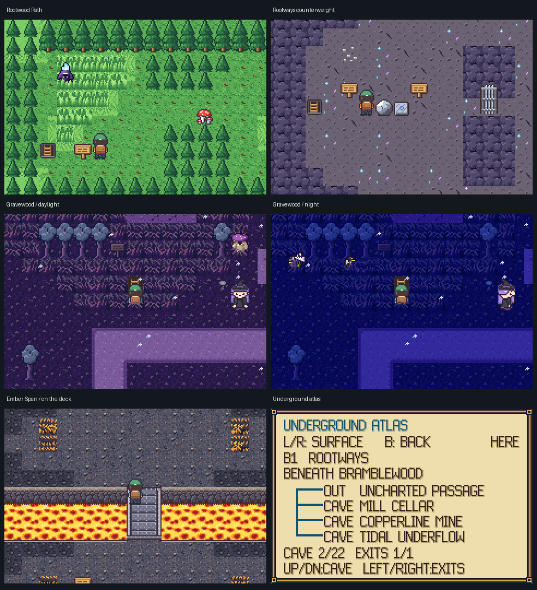
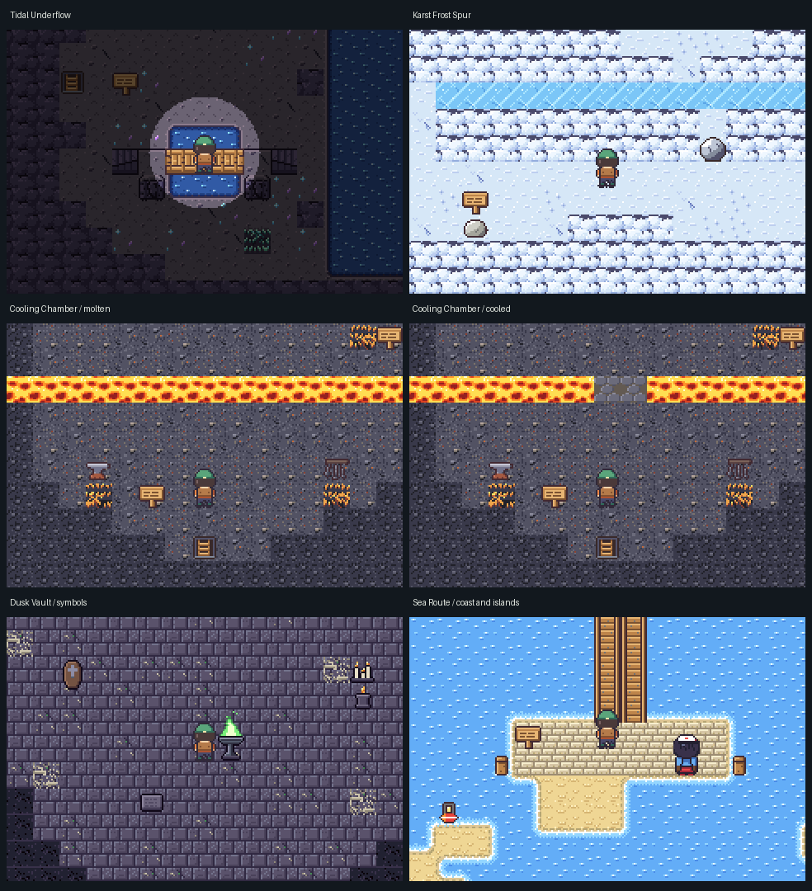

# Connected caves and route diversity

This expansion adds ten playable maps while preserving the existing surface
map dimensions, story milestones, and the sea journey to Gull Isle. It builds
on the packed per-area renderer, not a replacement rendering engine.

## Playing

Open **START → MAP** (TOWN MAP required). **L/R** switches between the surface
map and **UNDERGROUND ATLAS**. Inside a cave the map opens underground.
**Up/Down** selects a charted cave; **Left/Right** pages its connections.
**B** returns to the field. The atlas labels cave passages, surface exits,
and locks, identifies the current cave with HERE, and names its surface
region. Unvisited caves are not selectable and unknown destinations are not
named. FLY remains a surface-only operation.

This is a discovered-connection atlas of individually loaded cave maps, not
simultaneous surface/underground rendering or tile-by-tile fog of war. Local
bridge heights (0–3) remain independent of world depth (B1/B2).

## Regional networks

| Network | Route | Earliest through-route |
| --- | --- | --- |
| Rootways | Bramblewood hollow → **Rootwood Path** (20×10) → **Rootways** (24×17) → **Mill Cellar** (13×9) → Brookmill Mill; another branch enters Copperline Mine | Volt Crest |
| Tidal Underflow | Heron Fen → Reed Tunnel → **Tidal Underflow** → Reedwick sluice / Port Brine quay | Tide Crest; the main channel also needs SURF |
| Northern Karst | Stormstep Cave → **Karst Chamber** → Glimmer Caverns; **Karst Frost Spur** branches to Timberline's sawmill | Anvil Crest; the frost stopper needs STRENGTH |
| Ember Conduits | Railhead Collapsed Shaft → **Ember Span** → **Cooling Chamber** → Ember Tunnel / Cindermoor | Anvil Crest |
| Dusk Hollows | Chalk Barrow → **Dusk Vault** → **Root Gallery** → Gravewood sinkhole / Duskmere well | Rime Crest |

Later links connect **Rootways ↔ Underflow** after Tide,
**Copperline Mine ↔ Collapsed Shaft** after Anvil, and
**Cooling Chamber ↔ Root Gallery** after Lantern. The north remains its own
regional cave system. The Ossuary still requires the original six-crest
progression; no new passage goes behind a Hall Master.

Exact entrance/arrival coordinates and geometry are recorded in
[rootways](handoff/rootways.md), [underflow/karst](handoff/underflow_karst.md),
and [ember/hollows](handoff/ember_hollows.md). All new multi-entrance returns
are explicit portals rather than inferred nearest-parent exit mats.

## Puzzles and visual changes

- **Root counterweight:** push the light pumice east onto the plate. The
  central gate remains open; longer loops keep the room escapable.
- **Reed sluice:** floor controls on both banks lower the gallery barrier.
  The second control is important: switches reset on reload, so the return
  journey must not depend on a control behind the closed barrier.
- **Frost stopper:** push the stone north twice, then slide east to stop
  beneath the cellar turn. A dry lower return route remains available.
- **Cooling chamber:** operate the intake and release fixtures in order.
  Two lava cells become permanent basalt; all other lava stays blocked.
- **Dusk symbols:** Root → Bell → Lantern opens the well shortcut. An
  incorrect sequence resets harmlessly. The solved two-cell opening also
  lets a traveller arriving from Duskmere walk inward rather than rewarp.

Gravewood uses the appended **TS_DUSK** art catalog: leafy silhouettes,
cool canopy colours, violet earth and moss, retaining the original GRIM
collision and glyph contract. It is not a lantern-darkness forest. The
Sea Route has interior sandbars/coves without a new foot crossing. New
water and iron-over-lava bridges use the existing elevation engine.
Coast foam, cave wall highlights and volcanic bridge fascia have bounded
art improvements. Compact puzzle rooms are safe areas rather than declaring
wild zones with no meaningful encounter habitat.

## Authoring contract

1. Append map/flag/script IDs inside their owning region; do not reorder or
   delete existing entries. Append persistent objects and hidden features in
   existing maps as well. Regional growth is rebased through saved layouts;
   preserving every global numeric enum value is not required.
2. Cave `MapDef` entries set `.depth` and `.surface_map`, and include
   `MF_NOFLY`. Depth is metadata; ordinary house interiors remain depth 0.
3. Author actual `A_DOOR` cells (ladder objects, door glyphs, or stamps).
   A plain floor coordinate in WARPS is intentionally not an automatic
   trigger: that would bypass existing flag-patched door seals.
4. Pair portals explicitly. `.required_flag` is checked by the shared
   `warp_is_open()` predicate before movement. Zero means unrestricted.
   Arrival cells must be safe and adjacent to—not on—the return door.
   Gates must protect every relevant approach. Examine a locked door with A
   for its requirement.
5. Use `FIXTURE` for an immobile scripted control rendered by solid map
   decor. It keeps normal interaction/collision but does not draw a person
   over the prop. Both overview renderers follow this rule.
6. Put clues on visible, solid, reachable props or rock faces. Do not add
   invisible sign coordinates. Avoid putting props on puzzle approach cells.
7. Keep maps ≤64×64, ≤48 runtime objects per map, the world below 255 map
   IDs, persistent puzzle bits ≤128, and hidden-passage bits ≤64. Scene
   residency must fit 768 tiles; palettes stay in banks 0–7. Use fades when
   the current horizontal-seam compatibility contract is not met.
8. Review and regenerate the save manifest centrally. Accept golden growth
   only after reviewing ID prefixes and old-save migration; leave the frozen
   version-5 snapshot unchanged.

## Saved positions

The binary save version is unchanged. Existing layout rebasing migrates map
IDs, flags, visits and per-map persistent bits after regional appends. After
loading saved flags and patches, invalid terrain positions recover at a
unique safe authored entrance, or otherwise at the last Hearth. Valid
bridge and surfing positions remain intact. NPCs and kin returning to home
cells are transient occupancy, not a reason to relocate a valid saved tile.
Checksums and inventory/party validation remain required.

A genuine version-7 fixture generated from the pre-expansion commit was
loaded into this expansion: its map/position, kin origin, inventory, money,
late-region flag and visits survived; all 21 old puzzle bits and 16 secrets
remained set, while the new Rootways gate remained unsolved. No player save
was used for this check.

## Validation and reproduction

- `make test`: host rules, all maps, region suites, gates, saves, rendering,
  and puzzle searches. `test_underworld.c` drives gated doors through real
  movement and checks atlas discovery, layer switching and field restoration.
- `test_puzzles.c`: the broad state-space/soft-lock solver plus strict
  single-entry cave searches with no implicit reentry. A disconnected
  negative fixture is rejected. Script puzzles additionally prove reachable
  controls and use real regional handlers to stage solved terrain; their
  interaction/order tests live in `test_ember_hollows.c`.
- `make`: ARM ROM build and header validation.
- `python3 tools/render_maps.py build/world-expansion/maps`: layout previews;
  these do not reproduce the hardware lantern window.
- `make shot && python3 tools/capture_underworld.py`: checked disposable save
  fixtures and actual libmGBA captures, with ROM map/position observations.
  It also walks the counterweight and lava deck and verifies their resulting
  persistent gate bit / actor height. Output is confined to
  `build/world-expansion/rom`; no user save is touched.

This validates the new traversal and visuals, not a complete campaign
playthrough or a new playtime estimate. The existing campaign playtest
caveats in the README still apply.

### Observed integration results

- Complete `make test`: exit 0. Strict cave sweep: **40 entry searches, zero
  failures**, plus the broad **170 map/ability combinations** and soft-lock checks.
- **46 guarded portals** exercised through real player movement.
- Area residency: **185 maps**, peak **511/768** tiles, no overflow.
- Elevation sprite composition: **42 crossings**, **11,364 frames**, no
  priority leaks or mid-step priority flips. This rendering-only fixture
  suppresses random spawns and warden bouts; battle behavior has separate tests.
- ARM build/header validation passed; the verified ROM is **3,722,248 bytes**.
- Actual world-layout rendering passed without overlaps; 11 selected layout
  previews and 11 ROM scene captures were produced. The ROM also opened the
  Rootways gate by pushing the stone and walked onto the level-1 lava deck.

