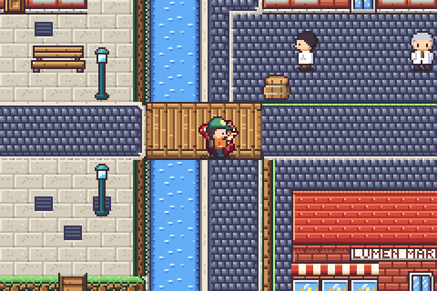
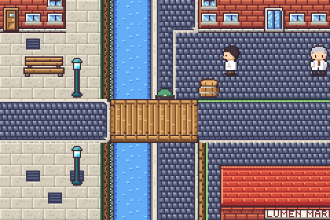
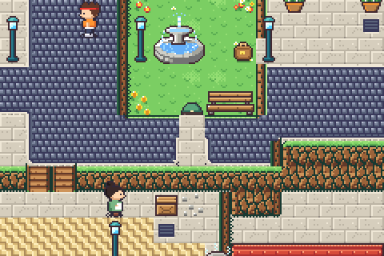

# Towns: LUMEN CITY redesigned (region east)

Lumen City is now a lamp-lit **hill city on four levels** (56x50, was a
48x44 walled rectangle with a street grid). The map data is in
`src/game/world/east/data.h` (a header comment above `LUMEN_ROWS` explains
the layout); the authoring format is `docs/ELEVATION.md`.

  

## Layout

| level | district | what's there |
| --- | --- | --- |
| 3 | **The Crown** (north) | Volt Hall, row houses, tinker's house, the Spire's clock tower, the north gate (x 24-25) in the old rampart. A wooded bluff to the west, forest to the east, a wooded rise behind the tinker's. |
| 2 | **Beacon terrace** | the octagonal plaza with the BEACON, raised above everything around it; a bastion with double stairs down to the canal quarter, grand stairs up to the Crown, ledges from the Crown walk. |
| 2 (sunken) | **Well garden** | a sunken garden inside the Crown, seen from the avenue, reached only by the hidden conduit. WAYSTONE satchel. |
| 1 | west terrace, inn strip, east ward, Lumen Park | Hearth Hall + bike shop by the west gate (y 20-21); the Kettle Inn beside the plaza; the market by the east gate (y 20-21); the park with tall grass and warden ARLO. |
| 0 | **The Cut**, canal quarter, basin, gardens | the canal and its towpath in a gorge with the Resonance Works yard at its head; the canal quarter with a winding stair lane, the low canal, the basin (to the south edge, with a tree islet) and the canal gardens. |

- **Over and under:** the Boulevard (E-W) crosses the Cut on a bridge
  (`BRIDGE_H 40-43, 20-21`, deck level 1). The towpath (x 42-43, level 0)
  runs **under** it: it is the only way to the Resonance Works (from the
  canal side via the park stairs (45,33)). Integral to routing.
- **Stepped Boulevard:** from the west gate it climbs onto the plaza by side
  stairs (16, 20-21) and drops to the inn strip (32, 20-21) before the bridge.
- **Multi-row cliffs:** Crown → Works yard 3 rows; Crown → west terrace and
  inn strip 2 rows (the Volt forecourt stairs (10,11-12) are a two-level
  staircase); plaza → canal quarter 2 rows (bastion stairs 24-25, 26-27);
  east forest → east ward 2 rows; bluff → west terrace 2 rows.
- **One-way shortcuts:** ledges from the Crown walk onto the plaza (17-18, 11)
  and from the west terrace into the canal quarter (10-12, 27).
- **Hidden paths:** (1) the old conduit: a `TUNNEL` under the Crown walk
  (30, 8-9) whose mouth (30, 10) is `HIDDEN` in the plaza's north cliff; hint:
  pebbles and a crate beside it, and the LAMPLIGHTER (who paces there) now
  mentions "the old WELL garden, if you know the way through the wall".
  Leads to the WAYSTONE. (2) A gap in the park's tree line (52, 44-45) to the
  lamplighters' grove with the SWIFT COIL.
- Silhouette: wooded bluff and forest on the north corners, rampart only
  around the north gate, walls only by the west gate, the basin running off
  the south edge, jagged tree lines and shores.

## Moved (all consistent)

- Doors (`warps.inc`): Volt Hall (10,6), Hearth (9,17), bike shop (7,26), inn
  (35,16), Works (47,16), market (49,26), Lumen House (5,32), Spire (48,7),
  tinker (40,5). Interiors unchanged; each exit mat still leads back out of
  its own door (test_east).
- People: guide (26,4), lamplighter (26,11), kid + KETTLEKIN (16,41), fisher
  (9,35), engineer (45,18), clockwatcher (49,18, looking up the 3-row cliff),
  warden ARLO (53,34).
- Signs: north gate (23,2), west gate (2,19), east gate (51,22), Lumen City
  (17,19), Spire (43,7). Satchels: FOCUS COIL (2,45), SWIFT COIL (51,46),
  WAYSTONE (32,5). Fly point lands at (9,18) (tools/make_media.py follows).
- Edge contracts unchanged: north x 24-25, west and east y 20-21 (the only
  open edge cells, tested).

## Tests

- `tools/tests/test_east.c`: `test_lumen_heights` checks over/under the
  bridge, the Works yard, the conduit to the Well garden, the four levels,
  and that **every decor kind on the east maps actually loads** (see below);
  the Volt Hall walk-in test uses the new door.
- `make test` green, including `test_puzzles` (Lumen: 22/22 targets) and the
  level-aware reachability; no warnings.

## Found on the way (for other owners)

- **Silent decor overflow.** Tilesets now carry ~88 tiles of elevation art
  (city: 398 tiles), so a map's decor has ~114 tiles left. `field_load_tileset`
  *skips* a decor kind that doesn't fit, which shows as garbage, and the budget
  check in `tools/test_field.c` (`decor_tiles_used > 512`) can never fire
  because the loader never goes past 512. Old Lumen lost CAFE_TABLE, PEBBLES,
  CRATE, CRATE_STACK, BIG_TREE and LILY_PADS this way. test_east now checks
  `decor_base[kind] != 0` for the east maps; the same check in test_field for
  every map would catch other towns. I left test_field alone because it
  might fail maps owned by other sessions.
- The flat `BRIDGE_H/V` decor looked broken on the city tileset, and Lumen
  no longer uses it (the low canal ends in land in the west instead).
- The city tileset's elevation bridges are pale sandstone now (`'deck':
  'stone'` in `elevation.ROLES`), so the Boulevard bridge matches the city.

## Screenshots (in the ROM, build/shot)

`docs/images/lumen_front.png` (at the bridge), `lumen_under.png` (under the
deck on the towpath), `lumen_over.png` (on the deck), `lumen_stairs.png` (the
bastion stairs), `lumen_conduit.png` (vanishing into the conduit),
`lumen_well.png` (in the Well garden), `lumen_gap.png` / `lumen_grove.png`
(the tree-line gap). `make maps` → `build/maps/14_lumen_city.png`.
