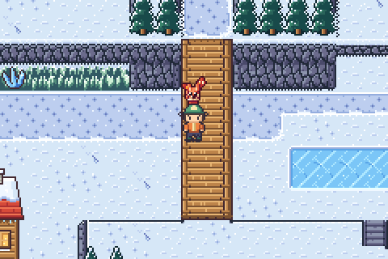
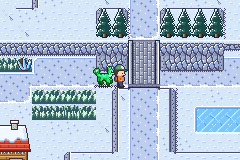
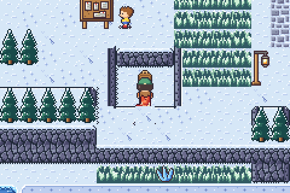
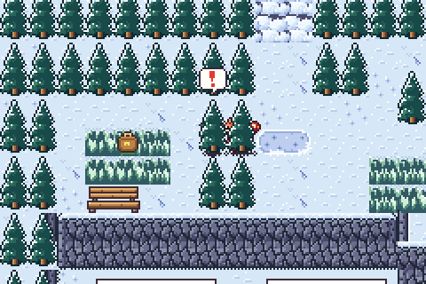
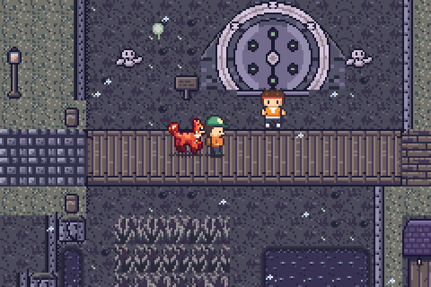
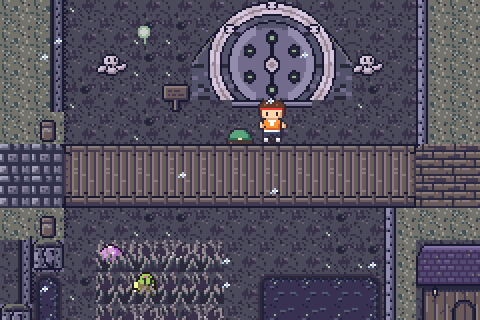
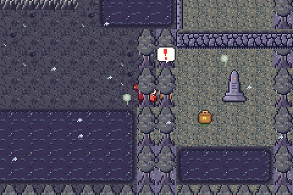
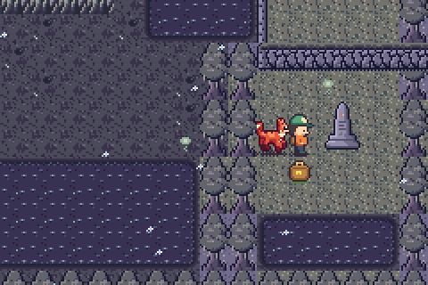

# Towns: FROSTHOLLOW and DUSKMERE redesigned (regions north, grim)

Both towns are rebuilt on the height layer (docs/ELEVATION.md). The map data
is in `src/game/world/north/data.h` (`FROSTHOLLOW_ROWS/_ELEV/_FEATS`, a
header comment above them explains the layout) and
`src/game/world/grim/data.h` (`DUSKMERE_ROWS/_ELEV/_FEATS`, same). Edit the
arrays directly; they are the source of truth.

| | |
| --- | --- |
|  the road over the Hollow Bridge |  the Hollow lane, about to pass under it |
|  inside the sunken store (hidden cut) |  the pine gap to the Watch |
|  on the Long Walk, the Ossuary gate below |  under the Long Walk (hat showing), on the way to the gate |
|  the hidden gap in the cypress |  the drowned chapel |

## FROSTHOLLOW (44x40, was a 40x36 box with a road cross)

A valley town under Whitecrown on four levels:

| level | district | what's there |
| --- | --- | --- |
| 3 | **Crownside** (north) | the road north (x 19-20), the RIME HALL on its shelf (two walkable rows in front), NE crags, the NW pine bluff, **the Watch** (a clearing behind a pine wall). |
| 1 | **Market terrace** | Hearth + Shop tucked under Crownside's two-row cliff, the octagonal ice-statue plaza, the notice board, the Glimmer cave at the foot of the east ridge (three rows of rock over the mouth), the **sunken store** (a pit in the terrace). |
| 2 | **Ridges** | pine-crowned ridges along the Hollow's north rim and above the lake, so the gorge wall is a two-row cliff (not walkable, pure silhouette). |
| 0 | **The Hollow**, **Steam Hollow**, low town | a gorge right across the town: lane, skating rink (flat ground, snow buffer rows around it), the bathhouse and the steaming pool under the three-row east cliff; the frozen lake reaching the west and south-west edges, the Alder house, the pond, the south road. |
| 1 / 3 | **South terrace**, **Stargazer's Knoll** | the terrace the bridge lands on; the knoll (3) with the stargazer's house and telescope, its cliff running off the south edge. |

- **Over and under:** the Hollow Bridge (`BRIDGE_V 19-20, rows 23-25`, stone)
  carries the road over the Hollow onto a spur of the south terrace
  (18-21, rows 26-29); the Hollow lane runs under it on rows 24-25 (hidden
  for two steps), and it is the only way from the lake basin in the west to
  the bathhouse (besides the terrace stairs and the ledges).
- **Stairs:** Crownside two-step staircase (19-20, 9-10); south road
  (19-20, 36); from the Hollow up onto the south terrace (26,30); side stairs
  climbing two levels onto the knoll (32-33, 33).
- **One-way shortcuts:** ledges from the plaza into the Hollow (25-27, 23),
  from the east market into the Steam Hollow (35-36, 22) and from the south
  terrace to the south road (23-26, 35).
- **Hidden:** (1) a `HIDDEN` mouth in the Hollow's north wall (11,23) leads
  through the old ice-cutters' cut (`TUNNEL 11, 21-22`) into the sunken store
  (10-12, 18-20), seen from the market but unreachable from it: STAR LANTERN
  x2. Hints: an ice crystal beside the mouth; the KID by the notice board now
  talks about the store and "the HOLLOW". (2) A gap in the pine wall (8-9,5),
  hinted by a path stub, to the Watch: bench, WAYSTONE.
- Moved (all consistent): doors Hearth (6,12), Shop (12,12), Rime Hall
  (28,6), Alder house (10,31), Stargazer (39,35), hot spring (38,27), Glimmer
  cave (36,16); elder (22,12), ice carver (24,15), skater (10,35, on the
  pond), hall guide (29,7), old miner (35,18), villager + TUXFLAKE (25,32),
  kid (10,16); signs (22,37) (32,7) (33,16); fly point (6,14); berry patch 24
  at (31,35). Edge contracts unchanged (x 19-20 north and south).
- Decor kinds: ICE_BLOCKS, BARREL and CRATE never loaded (the old map was
  over the 512-tile budget) and are gone; WOODPILE and SKI_RACK made room
  for TELESCOPE and ICE_CRYSTAL. 510/512 scene tiles.

## DUSKMERE (44x40, was a grid of paths on a mud square)

A stilt town on peat isles in the black mere, under the Hollowing's ash:

| level | district | what's there |
| --- | --- | --- |
| 1 | **Square isle** | the causeway from the west edge (y 20-21), Hearth + Shop, the round cobbled square with the mire bell and the bellkeeper, the bog fisher's pier, the **lamp jetty** north to the islet where the lantern for the lost burns. |
| 2 | **Lantern Hill** (north-east) | the graveyard (graves, crosses, bracken with wild kin), the LANTERN CRYPT, an iron railing along the top of the two-row cliff. Side stairs from the square (28,10). |
| 0 | **Gate yard** | the sealed OSSUARY gate cut into the foot of Lantern Hill's cliff, bones, a wisp; Gate Warden Osric. |
| 1 | **East isle** | the MIRE HOUSE (Widow Maren); ledges drop onto it from the graves (39-41, 13). |
| 0 | **Reed flats** | reeds (the MIRE wild zone), black pools, the lane north under the Long Walk; the **drowned chapel** in the south-east. |
| 1 | **Apothecary isle** | Mother Henbane's apothecary. |

- **Over and under:** THE LONG WALK (`BRIDGE_H 28-38, rows 20-21`) carries
  the square's road over the gate yard to the east isle; the only way to the
  Ossuary gate is the lane **under** it, from the reed flats (stairs 18-19,27
  and ledges 22-23,27 lead down from the square). "Nobody goes near it,
  everybody looks at it every day": the gate is in full view from the walk.
  HENBANE'S WALK (`BRIDGE_V 11-12, rows 27-30`) crosses the flats to the
  apothecary isle; the flats pass under it to a reed nook (OLD COIN x2).
- **Hidden:** a gap in the cypress screen (36-37,33), marked by drifting
  foxfire, to the drowned chapel: the Burning memorial and a REVIVAL BREW.
  The kid with NOXKIT now warns about following the foxfire into the cypress.
- Moved (all consistent): doors Hearth (12,12), Shop (17,12), apothecary
  (6,34), Mire House (40,26), Lantern Crypt (34,7); the Ossuary's exit lands
  at (35,19) beside Osric (34,19); bellkeeper (19,18), bog fisher (6,12),
  kid (15,23), lamplighter (22,11); signs (8,19) (31,8) (31,18); satchels
  REVIVAL BREW (39,34), OLD COIN (9,29), WAKE BELL (42,8); fly point (12,13).
  Edge contract unchanged (west y 20-21, the only open edge cells).
- **Tiles:** the grim tileset was at 497/500 and DUSKMERE silently lost its
  lanterns, pumpkins, moorings and wisps (they drew as garbage). The
  LANTERN CRYPT and BONE GATE stamps are now drawn mirror-symmetric
  (`mirror_lr` in `tools/tilesets/ts_grim.py`), so their right halves reuse
  the left halves' tiles: grim is 444 tiles. That also fixes ASHEN FIELDS
  (GR_CART) and GRAVEWOOD (GR_SHRUB). DUSKMERE uses 13 decor kinds, 509/512.
  `python3 tools/gen_field_gfx.py` regenerated `src/gfx_field.h` and the
  debug viewer maps (fewer grim pages).

## Tests

- `tools/test_field.c`: every map's decor kinds must actually load (the
  loader skipped kinds that did not fit and the old budget check could never
  fail). On this branch it fails only for west maps (SALTWIND TRAIL, PORT
  BRINE, SEA ROUTE, GULL ISLE, DROWNED BELL): the west agent owns those.
- `tools/tests/test_north.c` `test_frosthollow`: decor loads, the road over
  and the lane under the bridge, the bathhouse in the Steam Hollow, the store
  and the Watch behind hidden passages, the store is a pit. The ice carver's
  talk position follows him to (24,15).
- `tools/tests/test_grim.c` `test_duskmere`: decor loads, over/under the Long
  Walk, the gate in the sunken yard under the hill, the chapel behind the
  hidden gap, the Ossuary exit beside Osric. The haze test enters at the new
  fly point.
- The level-aware reachability flood, the elevation lint and test_puzzles
  pass for both towns.

## Screenshots

- In the ROM (`build/shot`): `build/towns_shots/*.png` (script:
  `fh_*` Frosthollow, `dm_*` Duskmere); copies in `docs/images/frosthollow_*`
  and `docs/images/duskmere_*`; `docs/images/region_{frosthollow,duskmere}.png`
  regenerated (fly points moved; `tools/make_media.py` follows).
- `make maps` -> `build/maps/39_frosthollow.png`, `build/maps/53_duskmere.png`.

## Left / ideas

- Done (docs/handoff/elevation.md, "Town art pass"): the Hollow Bridge is 3
  rows long over a narrowed Hollow; snow cliffs are light, frost-capped
  granite; snow bridges are frosted stone.
- Frosthollow's decor budget is full (510/512); a new decor kind needs one
  dropped. Grim has room again (Duskmere 509 with 13 kinds; the fields and
  Gravewood ~460).
- The reeds beside the lane to the gate, on the flats and the graveyard
  bracken are wild-kin grass (ZONE_MIRE); the isles are safe.
