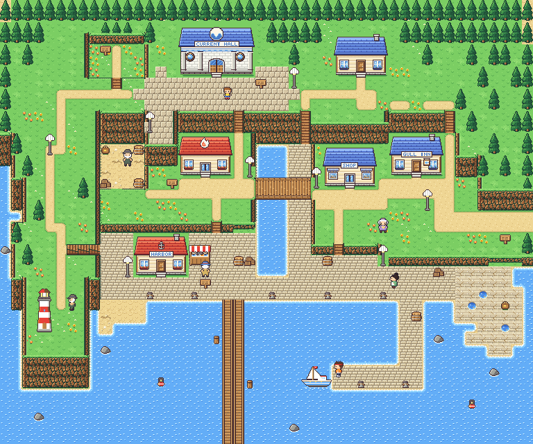
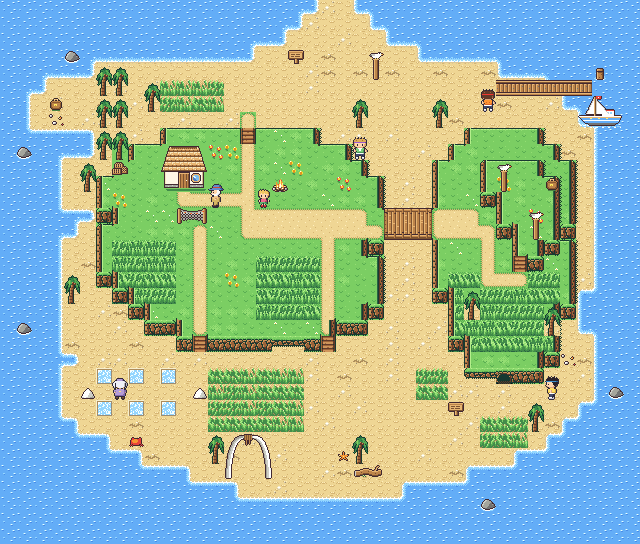

# West towns handoff: PORT BRINE and GULL ISLE on the height layer

Both west towns were rebuilt with the elevation engine (docs/ELEVATION.md):
three levels with multi-row sea cliffs, stairs, one-way ledges, a bridge you
walk over one way and under the other, a tunnel and a hidden passage each,
and a coastline instead of a box. Everything is in `src/game/world/west/`.
`make && make test` builds with zero warnings; every west check, the puzzle
solver and the elevation lint pass (see "Tests" for the two failures that
are not west's).

| Port Brine | Gull Isle |
| --- | --- |
|  |  |

## The tile budget fix (read this first)

The coast tileset had reached 478 tiles with the elevation art. A map loads
its tileset plus every decor kind it uses into the 512-tile scene
charblock, and `field_load_tileset()` **skips** a kind that doesn't fit, so
the kind is drawn from the tileset's own tiles: Port Brine drew 24 of its 28
prop kinds as garbage (bollards, signposts, piers, the lighthouse, the
ferry), Gull Isle 12, Saltwind 7, the Sea Route 3. The old budget test could
never fail because of the skip.

- **New 'tide' tileset** (`tools/tilesets/ts_tide.py`, art in
  `ts_coast.build_tide`): the CURRENT HALL and the DROWNED BELL (floor, walls,
  pools, currents, grotto, glowing pool). Same palette banks as 'coast';
  `decor_west.py` registers HALL_COLUMN, SHELL_LAMP, DROWNED_BELL,
  GROT_PILLAR, GLOW_CORAL, WHALE_CARVING for it. `pixelart.SETS` and
  `gen_field_gfx.TS_TAGS` got `'tide'` (appended: no other TS_ id moved).
  The travel test maps TEST HALL and TEST DARK use it too
  (`world/travel/maps.inc`).
- **'coast' dropped the legacy cliffs** (`C c L [ ]`: CLIFF, CLIFF_FACE,
  LEDGE, LEDGE_L, LEDGE_R): cliffs are the height layer now. SALTWIND TRAIL's
  bluff was converted (`SALTWIND_ELEV`: the meadow at level 1, stairs at
  (9,13) and (16,13), the ledge at (41-43,13)); TEST SHORE's walls are tide
  pools (`o`).
- **CAVE is a 1x1 stamp** (a dark door cell, the same tile as VOID): it goes
  on a TUNNEL mouth in an elevation cliff; the mouth art is drawn over it and
  the stamp gives the cell its `A_DOOR` (elev.c keeps `A_DOOR` on mouths).
- Result: coast 478 -> **407** tiles, tide 49. Port Brine uses 104 tiles of
  props (511/512), Gull Isle 104 (511), Saltwind/Sea Route far less.
  **Port Brine has 1 tile left**: a new prop kind there needs another one
  dropped (the kinds and their costs: LIGHTHOUSE 30, FERRY_BOAT 19,
  FISH_STALL 15, SHELL_LAMP 8, the rest 4 each).
- Tests: `test_west` now checks that every decor kind of every west map
  actually loaded (and caps coast at 410); `test_field` got the same check
  for every map (the coordinator's version). docs/ELEVATION.md section 8
  explains the per-map budget.

## PORT BRINE (48x40, was 48x44 of mostly empty sea)

A harbour town in a horseshoe around a basin. Heights: the upper town, LAMP
HEAD and the east bluff **3**, the two terraces **1**, the quays, the Gut and
the Smugglers' Hollow **0**. The cliff under the upper town is two rows, the
Gut head and the hollow three, the lighthouse tip drops three rows into the
sea, the terraces meet the quays in a one-row sea wall.

- **Upper town (3)**: CURRENT HALL (door 19,6) on CREST SQUARE with the
  CREST BASTION jutting over the west terrace (13-15, 10-12); the SKIPPER'S
  HOUSE (32,6); the sunken **SAILORS' GARDEN** (8-12, 3-6, level 2, entered
  by the `v` stairs at (10,7)) with a new sign; the street wanders east to
  the stairs down at (40,10-11).
- **LAMP HEAD**: the arm down the west side; a crest path to the
  LIGHTHOUSE on its tip (keeper at 6,27); a cliff notch bitten out of its
  seaward side; side stairs `<<<` at (6-8,22) climb 0 -> 3 from the quay.
- **West terrace (1)**: BRINE HEARTH HALL (door 18,15), ROPE WALK west to
  the bridge, stairs up (21,10-11) and down (19,20), a ledge `__` at
  (21-22,20) hops onto the pier head.
- **THE GUT**: a tidal cut (water 23-25, a stone lane 26-27) from the quays
  up to the foot of the upper-town cliff. **ROPE WALK crosses it on a bridge**
  (`EF(BRIDGE_H, 23, 16, 5, 2)`): the road east-west **over** it (the
  direct way from the Hearth to the shop, the inn and Saltwind), the lane
  north-south **under** it (the short way from the quays up the three-step
  staircase (27,10-12) to the Hall; the long way climbs a terrace and the
  upper-town stairs). Surfers can't enter (the Gut ends at
  the quay).
- **East terrace (1)**, stepped: BRINE SHOP (31,16), GULL INN (37,15), the
  road to SALTWIND (east edge rows 19-20), stairs down (30,22), a ledge
  `___` (44-46,23) onto the EAST ROCKS (tide pools, the MINT TEA satchel,
  back to the quay on foot).
- **Quays (0)**: HARBOR OFFICE (14,24), the fish stall, bollards, a sand
  slipway, the plank pier (20-21) south to the SEA ROUTE, and the
  **breakwater** curling out from the east quay with the FERRY moored at its
  head (OBJ at 29,34, ferryman 30,33, ferry landing 31,34 in `scripts.c`).
- **Hidden: the smugglers' run.** A crack in the quay wall at (10,20)
  (`EF(HIDDEN)` over the mouth of `EF(TUNNEL, 10, 17, 1, 3)` under the west
  terrace) leads north into the **Smugglers' Hollow** (9-12, 13-16), a sandy
  pit you can see from the terrace and the square but not climb down into:
  the OLD COIN satchel and a new person, the OLD SMUGGLER (lore line).

Screenshots (ROM, build/shot): `docs/images/towns_west/brine_gut_front.png`
(in front of the bridge), `brine_gut_under.png` (hidden under the deck),
`brine_gut_stairs.png` (the staircase out of the Gut), `brine_bridge_over.png`
(on the deck), `brine_tunnel_mouth.png` (the crack, with the "!"),
`brine_hollow.png`; README still `docs/images/region_brine.png`.

## GULL ISLE (40x34)

A round island. Heights: the beaches **0**, THE GREEN and the STACK **1**,
GULL CRAG **2** on the stack. Both plateaus have irregular edges.

- **The Green (1)**: ODA'S HUT (door 11,11; fly point 11,12), the camp,
  nets, tall grass; stairs up from the north beach (`v` at 15,8) and from the
  south beach (12,21) (20,21); a ledge `__` (17-18,21) onto the south dunes.
- **The gully**: a sand path (x 24-26) between the Green and the stack, from
  the north beach to the south beach. **The rope bridge**
  (`EF(BRIDGE_H, 24, 13, 3, 2)`) crosses it: **over** from the Green to the
  stack (the only way up there), **under** along the gully (the beach way
  from the ferry and the spit to the salt flats and the sea cave, besides
  climbing over the Green).
- **The stack (1) and GULL CRAG (2)**: gull posts, the berry patch (28,11),
  the REVIVAL BREW satchel on the crag (34,11), crag stairs (32,16), a ledge
  `__` (29-30,23) down to the cave beach.
- **The sea cave**: the DROWNED BELL door is a tunnel mouth in the stack's
  south cliff (`EF(TUNNEL, 31, 22, 1, 1)` + the 1x1 CAVE stamp at 31,23);
  WARDEN TANSY (34,24, looking west) guards the approach.
- **Hidden: the secret cove.** A wall of palms (x 6-7) on the north-west
  beach; `EF(HIDDEN, 6, 7, 2, 1)` lets you walk through the trunks into a
  sealed cove with the STARDUST CHIP satchel.
- Salt pans on the south-west flats (Oda stands among them), the whale-rib
  arch on the south beach, the ferry pier north-east (unchanged: OBJ 36,6,
  landing 33,5), the north spit to the SEA ROUTE (x 20-21).

Screenshots: `docs/images/towns_west/gull_under.png`, `gull_over.png`,
`gull_palms.png` (in the grove, "!"), `gull_cove.png`, `gull_cave_front.png`;
README still `docs/images/region_gull.png`.

## Other edits

- **SEA ROUTE**: its south sandbar narrows to a spit (rows 44-47) so its
  walkable edge (x 20-21) matches Gull Isle's new north spit (test_field's
  edge-landing check).
- `warps.inc`, `npcs.inc`, `signs.inc` (+ SAILORS' GARDEN), `satchels.inc`,
  `flypoints.inc`, `scripts.c` (the Brine ferry landing), `maps.inc`
  (`ELEV(...)` on Saltwind, Brine, Gull Isle; `TS_TIDE` on the Hall and the
  Bell). Interiors are unchanged: their exit mats find the doors that lead to
  them.
- `tools/make_media.py`: the region stills for brine/gull stand at (21,17)
  and (22,14). Shared test fixes: `tools/test_game.c` reseeds the rng before
  the damage-math check (it depended on how many NPCs the world data drew
  random numbers for; adding the smuggler broke it), `test_west.c` (Brine's
  south edge is `map_h - 1`).

## Tests

`make test` stops at test_field's new decor check, which fails for maps
that are **not west's**: FROSTHOLLOW (ICE_BLOCKS), ASHEN FIELDS (GR_CART),
GRAVEWOOD (GR_SHRUB), DUSKMERE (GR_LANTERN) — their props are skipped and
drawn as garbage in the ROM today (north and grim owners). Running every
test anyway: all pass except that one and `test_battle`'s "battle speed
plays a turn in well under 3/4 of the frames" (146 vs 186 frames), which
came in with the latest `expansion` merge (Lumen/far towns) and does not
involve west code.

## Left / ideas

- Port Brine is at 511/512 scene tiles: to add props, drop a kind (e.g. the
  PIER_POST or SEA_ROCK) or shrink the 73-tile CURRENT HALL stamp.
- Both towns keep `ZONE_NONE`/`ZONE_ISLE` as before; the Green's tall grass
  and the dunes are Gull Isle's encounter spots.
- The Gut ends at the quay (no surfing under the Rope Walk); a lifting
  footbridge (BRIDGE_H decor, 4 tiles) would let the water reach the basin
  if a tile is freed.
- Saltwind's bluff is a single straight face; it could use the same
  treatment as the towns.
